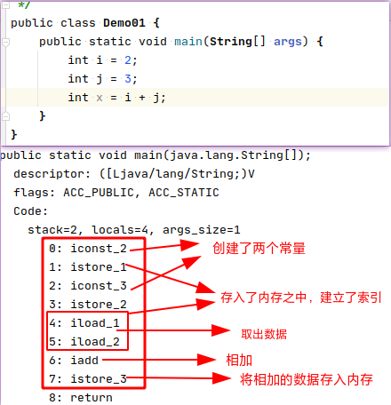
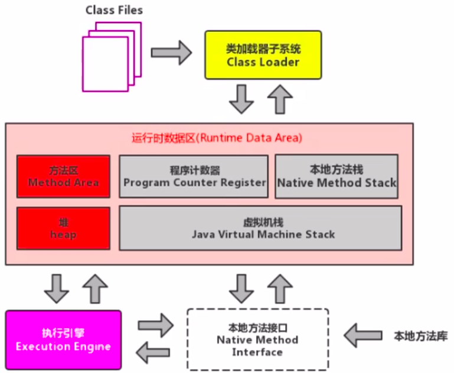
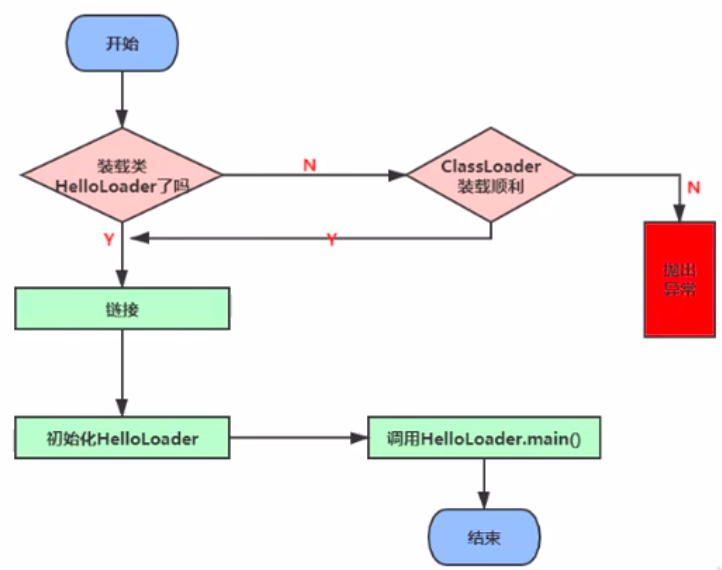
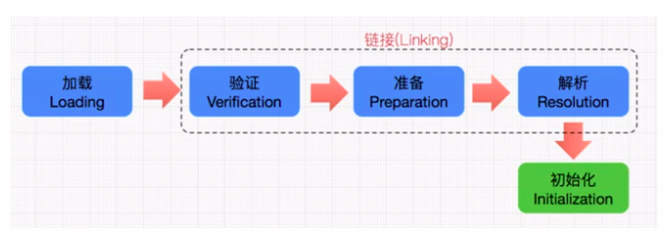
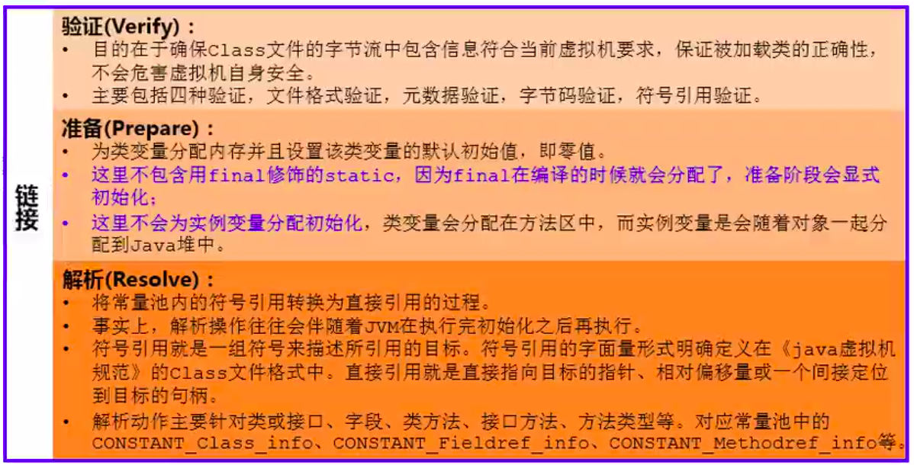
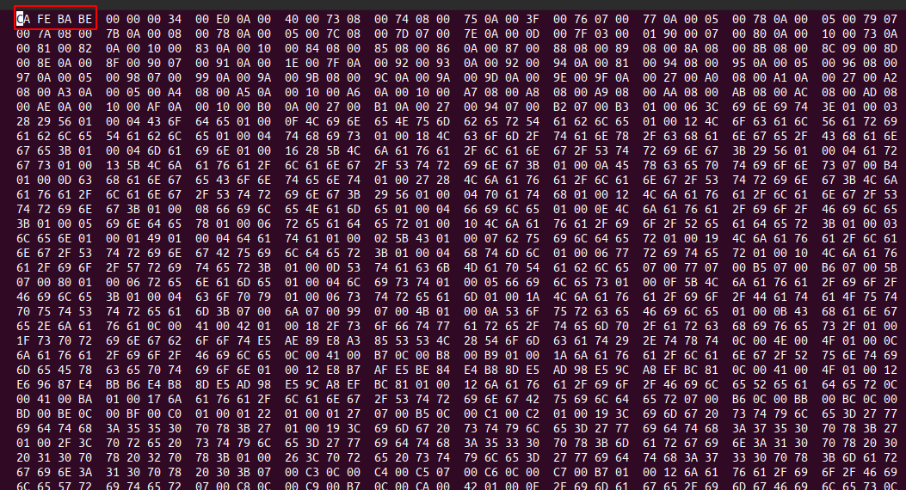
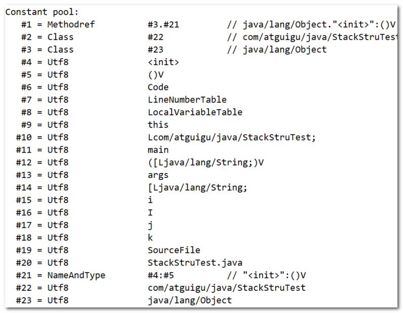
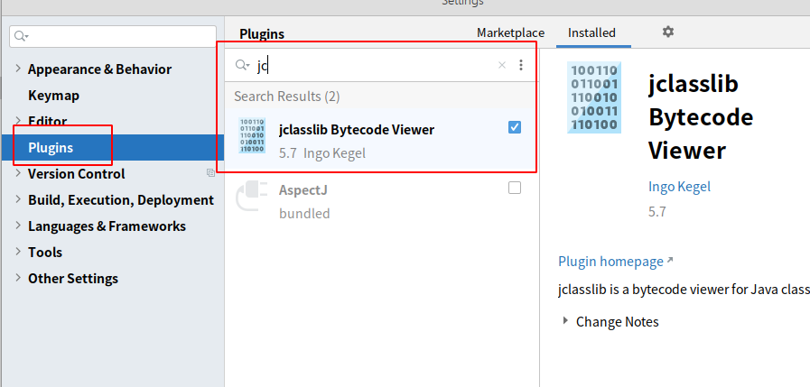
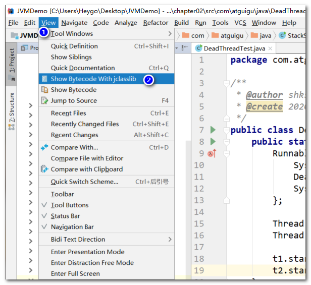
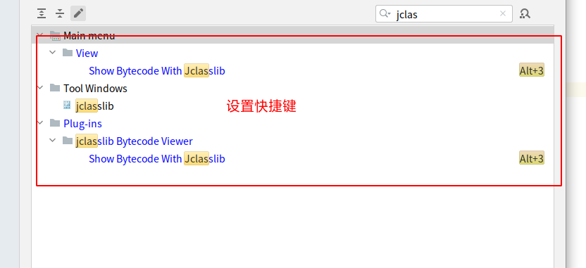

# 	JVM

**==现在主要用hotSpot、JRockit、J9三大虚拟机。==**

## 一、初识JVM

### 1.1、架构模型

Java的编译输入的指令流基本上是一种==基于栈的指令集架构==，另外一种指令集架构则是==基于寄存器的指令集架构==。

**两张架构的区别：**

基于栈式架构的特点(==跨平台、指令集少、指令多、性能低于寄存器==)：

- 设计和实现更简单，适用于资源受限的系统。
- 避开了寄存器的分配难题：使用零地址指令方式分配。
- 指令流中的指令大部分是零地址指令，其执行过程依赖于操作栈。指令集更小，编译器容易实现。
- 不需要硬件支持，可移植性好，更好实现跨平台。

基于寄存器架构的特点：

- 典型的应用是x86的二进制指令集：比如传统的PC以及Android的Davlik虚拟机。
- 指令集架构则完全依赖硬件，可移植性差。
- 性能优秀和执行更高效。
- 花费更少的指令去完成一项操作。
- 在大部分情况下，基于寄存器架构的指令集往往都以一地址指令、二地址指令和三地址指令为主，而基于栈式架构的指令集却是以零地址指令为主。

==栈式架构是指令集8位，而寄存器是16位，但寄存器使用的指令更少。==

**栈式架构：**



### 1.2、JVM的生命周期

**虚拟机的启动：**通过引导类加载器创建一个初始化类来完成的，这个类是由虚拟机的具体实现指定的**。**

**虚拟机的执行：**

- 一个运行的Java虚拟机有一个明确的任务：执行Java程序。
- 程序开始执行他才执行，程序结束时他就停止。
- <span style='color:red;'>执行一个所谓的Java程序的时候，真正执行的是一个叫Java虚拟机的进程。</span>


### 1.3、虚拟机 发展历程

#### 1.3.1、Sun Classic VM

1. 早在1996年Java1.0版本的时候，Sun公司发布了一款名为sun classic VM的Java虚拟机，它同时也是世界上第一款商用Java虚拟机，JDK1.4时完全被淘汰。
2. 这款虚拟机内部只提供解释器，没有即时编译器，因此效率比较低，即时编译器会把热点代码缓存起来，那么以后使用热点代码的时候，效率就比较高。
3. 如果使用JIT编译器，就需要进行外挂。但是一旦使用了JIT编译器，JIT就会接管虚拟机的执行系统。解释器就不再工作。解释器和编译器不能配合工作。
4. 现在Hotspot内置了此虚拟机。

#### 1.3.2、Exact VM

1. 为了解决上一个虚拟机问题，jdk1.2时，Sun提供了此虚拟机。
2. Exact Memory Management：准确式内存管理
   - 也可以叫Non-Conservative/Accurate Memory Management
   - 虚拟机可以知道内存中某个位置的数据具体是什么类型。
3. 具备现代高性能虚拟机的维形
   - 热点探测（寻找出热点代码进行缓存）
   - 编译器与解释器混合工作模式
4. 只在Solaris平台短暂使用，其他平台上还是classic vm，英雄气短，终被Hotspot虚拟机替换

#### 1.3.3、HotSpot VM

1. HotSpot历史

   - 最初由一家名为“Longview Technologies”的小公司设计
   - 1997年，此公司被Sun收购；2009年，Sun公司被甲骨文收购。
   - JDK1.3时，HotSpot VM成为默认虚拟机

2. 目前Hotspot占有绝对的市场地位，称霸武林。

   - 不管是现在仍在广泛使用的JDK6，还是使用比例较多的JDK8中，默认的虚拟机都是HotSpot
   - Sun/oracle JDK和openJDK的默认虚拟机
   - 因此本课程中默认介绍的虚拟机都是HotSpot，相关机制也主要是指HotSpot的GC机制。（比如其他两个商用虚机都没有方法区的概念）

3. 从服务器、桌面到移动端、嵌入式都有应用。

4. 名称中的HotSpot指的就是它的热点代码探测技术。

   - 通过计数器找到最具编译价值代码，触发即时编译或栈上替换

   - 通过编译器与解释器协同工作，在最优化的程序响应时间与最佳执行性能中取得平衡

#### 1.3.4、JRockit

1. 专注于服务器端应用：它可以不太关注程序启动速度，因此JRockit内部不包含解析器实现，全部代码都靠即时编译器编译后执行。
2. 大量的行业基准测试显示，JRockit JVM是世界上最快的JVM：使用JRockit产品，客户已经体验到了显著的性能提高（一些超过了70%）和硬件成本的减少（达50%）。
3. 优势：全面的Java运行时解决方案组合
   - JRockit面向延迟敏感型应用的解决方案JRockit Real Time提供以毫秒或微秒级的JVM响应时间，适合财务、军事指挥、电信网络的需要
   - Mission Control服务套件，它是一组以极低的开销来监控、管理和分析生产环境中的应用程序的工具。
4. 2008年，JRockit被Oracle收购。
5. Oracle表达了整合两大优秀虚拟机的工作，大致在JDK8中完成。整合的方式是在HotSpot的基础上，移植JRockit的优秀特性。
6. 高斯林：目前就职于谷歌，研究人工智能和水下机器人

#### 1.3.5、IBM的J9

1. 全称：IBM Technology for Java Virtual Machine，简称IT4J，内部代号：J9
2. 市场定位与HotSpot接近，服务器端、桌面应用、嵌入式等多用途VM广泛用于IBM的各种Java产品。
3. 目前，有影响力的三大商用虚拟机之一，也号称是世界上最快的Java虚拟机。
4. 2017年左右，IBM发布了开源J9VM，命名为openJ9，交给Eclipse基金会管理，也称为Eclipse OpenJ9
5. OpenJDK -> 是JDK开源了，包括了虚拟机

#### 1.3.6、KVM和CDC / CLDC Hotspot

1. Oracle在Java ME产品线上的两款虚拟机为：CDC/CLDC HotSpot Implementation VM KVM（Kilobyte）是CLDC-HI早期产品目前移动领域地位尴尬，智能机被Android和iOS二分天下。
2. KVM简单、轻量、高度可移植，面向更低端的设备上还维持自己的一片市场
   - 智能控制器、传感器
   - 老人手机、经济欠发达地区的功能手机
3. 所有的虚拟机的原则：一次编译，到处运行。

#### 1.3.7、Azul VM

1. 前面三大“高性能Java虚拟机”使用在通用硬件平台上这里Azul VW和BEA Liquid VM是与特定硬件平台绑定、软硬件配合的专有虚拟机：高性能Java虚拟机中的战斗机。
2. Azul VM是Azul Systems公司在HotSpot基础上进行大量改进，运行于Azul Systems公司的专有硬件Vega系统上的Java虚拟机。
3. 每个Azul VM实例都可以管理至少数十个CPU和数百GB内存的硬件资源，并提供在巨大内存范围内实现可控的GC时间的垃圾收集器、专有硬件优化的线程调度等优秀特性。
4. 2010年，Azul Systems公司开始从硬件转向软件，发布了自己的Zing JVM，可以在通用x86平台上提供接近于Vega系统的特性。

#### 1.3.8、Liquid VM

1. 高性能Java虚拟机中的战斗机。
2. BEA公司开发的，直接运行在自家Hypervisor系统上
3. Liquid VM即是现在的JRockit VE（Virtual Edition）
4. Liquid VM不需要操作系统的支持，或者说它自己本身实现了一个专用操作系统的必要功能，如线程调度、文件系统、网络支持等。
5. 随着JRockit虚拟机终止开发，Liquid vM项目也停止了。

#### 1.3.9、Apache Marmony

1. Apache也曾经推出过与JDK1.5和JDK1.6兼容的Java运行平台Apache Harmony。
2. 它是IElf和Intel联合开发的开源JVM，受到同样开源的Open JDK的压制，Sun坚决不让Harmony获得JCP认证，最终于2011年退役，IBM转而参与OpenJDK
3. 虽然目前并没有Apache Harmony被大规模商用的案例，但是它的Java类库代码吸纳进了Android SDK。

#### 1.3.10、Micorsoft JVM

1. 微软为了在IE3浏览器中支持Java Applets，开发了Microsoft JVM。
2. 只能在window平台下运行。但确是当时Windows下性能最好的Java VM。
3. 1997年，Sun以侵犯商标、不正当竞争罪名指控微软成功，赔了Sun很多钱。微软WindowsXP SP3中抹掉了其VM。现在Windows上安装的jdk都是HotSpot。

#### 1.3.11、Taobao JVM

1. 由AliJVM团队发布。阿里，国内使用Java最强大的公司，覆盖云计算、金融、物流、电商等众多领域，需要解决高并发、高可用、分布式的复合问题。有大量的开源产品。
2. 基于OpenJDK开发了自己的定制版本AlibabaJDK，简称AJDK。是整个阿里Java体系的基石。
3. 基于OpenJDK Hotspot VM发布的国内第一个优化、深度定制且开源的高性能服务器版Java虚拟机。
   - 创新的GCIH（GCinvisible heap）技术实现了off-heap，即将生命周期较长的Java对象从heap中移到heap之外，并且GC不能管理GCIH内部的Java对象，以此达到降低GC的回收频率和提升GC的回收效率的目的。
   - GCIH中的对象还能够在多个Java虚拟机进程中实现共享
   - 使用crc32指令实现JvM intrinsic降低JNI的调用开销
   - PMU hardware的Java profiling tool和诊断协助功能
   - 针对大数据场景的ZenGC
4. taobao vm应用在阿里产品上性能高，硬件严重依赖inte1的cpu，损失了兼容性，但提高了性能
5. 目前已经在淘宝、天猫上线，把Oracle官方JvM版本全部替换了。

#### 1.3.12、Dalvik VM

1. 谷歌开发的，应用于Android系统，并在Android2.2中提供了JIT，发展迅猛。
2. Dalvik VM只能称作虚拟机，而不能称作“Java虚拟机”，它没有遵循 Java虚拟机规范
3. 不能直接执行Java的Class文件
4. 基于寄存器架构，不是jvm的栈架构。
5. 执行的是编译以后的dex（Dalvik Executable）文件。执行效率比较高。
6. 它执行的dex（Dalvik Executable）文件可以通过class文件转化而来，使用Java语法编写应用程序，可以直接使用大部分的Java API等。
7. Android 5.0使用支持提前编译（Ahead of Time Compilation，AoT）的ART VM替换Dalvik VM。

#### 1.3.13、Graal VM

1. 2018年4月，Oracle Labs公开了GraalvM，号称 “Run Programs Faster Anywhere”，勃勃野心。与1995年java的”write once，run anywhere"遥相呼应。
2. GraalVM在HotSpot VM基础上增强而成的跨语言全栈虚拟机，可以作为“任何语言”
   的运行平台使用。语言包括：Java、Scala、Groovy、Kotlin；C、C++、Javascript、Ruby、Python、R等
3. 支持不同语言中混用对方的接口和对象，支持这些语言使用已经编写好的本地库文件
4. 工作原理是将这些语言的源代码或源代码编译后的中间格式，通过解释器转换为能被Graal VM接受的中间表示。Graal VM提供Truffle工具集快速构建面向一种新语言的解释器。在运行时还能进行即时编译优化，获得比原生编译器更优秀的执行效率。
5. 如果说HotSpot有一天真的被取代，Graalvm希望最大。但是Java的软件生态没有丝毫变化。

## 二、类加载子系统

### 2.1、类的加载过程

==内存模型：==



**类的加载过程：**



完整的流程图如下所示：**加载 --> 链接（验证 --> 准备 --> 解析） --> 初始化**



### 2.2、加载阶段

> **加载流程**

1. **通过一个类的全限定名获取定义此类的二进制字节流**
2. 将这个字节流所代表的静态存储结构转化为**方法区的运行时数据结构**
3. **在内存中生成一个代表这个类的java.lang.Class对象**，作为方法区这个类的各种数据的访问入口

> **加载class文件的方式**

1. 从本地系统中直接加载
2. 通过网络获取，典型场景：Web Applet
3. 从zip压缩包中读取，成为日后jar、war格式的基础
4. 运行时计算生成，使用最多的是：动态代理技术
5. 由其他文件生成，典型场景：JSP应用从专有数据库中提取.class文件，比较少见
6. 从加密文件中获取，典型的防Class文件被反编译的保护措施

### 3.3、链接阶段

- **链接分为三个子阶段：验证 --> 准备 --> 解析**



#### 3.3.1、验证(Verify)

> **验证**

1. **目的在于确保Class文件的字节流中包含信息符合当前虚拟机要求，保证被加载类的正确性，不会危害虚拟机自身安全**
2. 主要包括四种验证，文件格式验证，元数据验证，字节码验证，符号引用验证。

> **举例**

- 查看字节码文件，其开头均为 CA FE BA BE ，如果出现不合法的字节码文件，那么将会验证不通过



#### 3.3.2、准备(Prepare)

> **准备**

1. **为类变量分配内存并且设置该类变量的默认初始值，即零值**
2. 这里不包含用final修饰的static，因为final在编译的时候就会分配好了默认值，准备阶段会显式初始化
3. 注意：这里不会为实例变量分配初始化，类变量会分配在方法区中，而实例变量是会随着对象一起分配到Java堆中

> **举例**

- 代码：变量a在准备阶段会赋初始值，但不是1，而是0，在初始化阶段会被赋值为 1

```java
public class HelloApp {
    private static int a = 1;   //prepare：a = 0 ---> initial : a = 1

    public static void main(String[] args) {
        System.out.println(a);
    }
}
1234567
```

#### 3.3.3、解析(Resolve)

> **解析**

1. **将常量池内的符号引用转换为直接引用的过程**
2. 事实上，解析操作往往会伴随着JVM在执行完初始化之后再执行
3. 符号引用就是一组符号来描述所引用的目标。符号引用的字面量形式明确定义在《java虚拟机规范》的class文件格式中。直接引用就是直接指向目标的指针、相对偏移量或一个间接定位到目标的句柄
4. 解析动作主要针对类或接口、字段、类方法、接口方法、方法类型等。对应常量池中的CONSTANT Class info、CONSTANT Fieldref info、CONSTANT Methodref info等

> **符号引用**

- 反编译 class 文件后可以查看符号引用



### 3.4、初始化阶段

> **初始化阶段**

1. **初始化阶段就是执行类构造器方法`<clinit>()`的过程**
2. 此方法不需定义，是javac编译器自动收集类中的所有类变量的赋值动作和静态代码块中的语句合并而来。也就是说，**当我们代码中包含static变量的时候，就会有clinit方法**
3. **`<clinit>()`方法中的指令按语句在源文件中出现的顺序执行**
4. `<clinit>()`不同于类的构造器。（关联：构造器是虚拟机视角下的`<init>()`）
5. **若该类具有父类，JVM会保证子类的`<clinit>()`执行前，父类的`<clinit>()`已经执行完毕**
6. **虚拟机必须保证一个类的`<clinit>()`方法在多线程下被同步加锁**

> **IDEA 中安装 JClassLib 插件**

在 IDEA 中安装 JClassLib 插件后，重启 IDEA 生效



- 选中对应的 Java 类文件，注意：不是字节码文件~！
- 点击【View --> Show Bytecode With jclasslib】即可查看反编译后的代码

(../Typora图片/JVM/aHR0cDovL2hleWdvLm9zcy1jbi1zaGFuZ2hhaS5hbGl5dW5jcy5jb20vaW1hZ2VzL2ltYWdlLTIwMjAwNzI3MTU1MjIzNjQzLnBuZw

