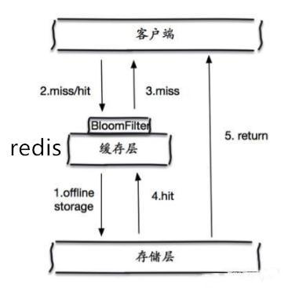
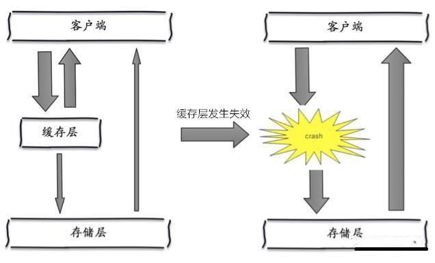

# Redis

## 一、概述

> 什么是redis

<font style="color:red">redis的作者Salvatore Sanfilippo。</font>

Redis（Remote Dictionary Server )，即==远程字典服务==，是一个开源的使用ANSI ==C语言编写==、==支持网络==、==可基于内存亦可持久化的日志型、Key-Value数据库==，并提供多种语言的API。

redis会周期性的把更新的数据写入磁盘或者把修改操作写入追加的记录文件，并且在此基础上实现了master-slave(主从)同步。

> redis特点

1、Redis以内存作为数据存储介质，读写数据的效率极高。

2、Redis跟memcache不同的是，储存在Redis中的数据是持久化的，断电或重启，数据也不会丢失。

3、Redis的存储分为内存存储、磁盘存储和log文件。

4、Redis可以从磁盘重新将数据加载到内存中，也可以通过配置文件对其进行配置，因此，redis才能实现持久化。

5、Redis支持主从模式，可以配置集群，更利于支撑大型的项目。

> 应用场景

==众多语言都支持Redis，因为Redis交换数据快，在服务器中常用来存储一些需要频繁调取的数据，节省内存开销，也极大的提升了速度。==

将一些热点数据存储到Redis中，要用的时候，直接从内存取，极大的提高了速度和节约了服务器的开销。

1、会话缓存（最常用） 

2、消息队列（支付）

3、活动排行榜或计数

4、发布，订阅消息（消息通知）

5、商品列表，评论列表

> 其他

1、redis有16个数据库，默认使用第0个，使用`select 2`可以切换成第二个数据库。

2、使用`DBSIZE`可以查看数据库存储数据大小，每个数据库存储的值是==隔离==的。

## 二、基础使用

>docker下的redis安装(默认都会使用docker)

**启动命令**

- docker的redis没有redis.conf，需要去github对应版本的复制。
- 新建` /root/docker/redis/conf`和`/root/docker/redis/data`这两个目录。
- 将获取到的`redis.conf`的内容粘贴到`/root/docker/redis/conf`目录下的redis.conf内。

> 修改redis.conf

````、
bind 0.0.0.0 		# 将ip改成这样可以让远程也可以使用，但也不安全
protected-mode no	# 关闭安全模式，不然外网不能连
requirepass 123456	# 设置密码Java测试时需要,默认是没有的
````

**使用的是阿里云服务器进行远程连接测试：**

- 本地redis下载后只需要运行(==docker run -p 6379:6379 --name redis-learn -v /root/docker/redis/data:/data -d redis==)。
- redis默认就是使用本地连接的。

````
#下载并安装redis 
tan@dark:~$ docker pull redis
# 启动redis
[root@iZ2zefhjd3vvridjd19bx0Z redis]# docker run -p 6379:6379 \
--name redis-learn -v /root/docker/redis/conf/redis.conf:/etc/redis/redis.conf \
-v /root/docker/redis/data:/data -d redis --requirepass "123456" --appendonly yes
# 进入容器内部
tan@dark:~$ docker exec -it e7c9ee1c9653 /bin/bash
````

> 启动命令

````
# docker容器启动，表示redis服务就是开启的,是不需要开启redis-server的

# 开启redis-server服务
redis-server redis.conf #redis.conf的绝对路径

# 未修改redis.conf内的端口，不填则默认为6379
redis-cli -p 端口号 (比如6379)
````

> 性能测试

````
redis-benchmark # 用于进行性能测试
````

**性能测试指令表：**


````
# 测试 100个并发连接数和100000个请求数

root@e7c9ee1c9653:/bin# redis-benchmark -c 100 -n 100000 -q
PING_INLINE: 115473.45 requests per second
PING_BULK: 118203.30 requests per second
SET: 108108.11 requests per second
GET: 117924.53 requests per second
INCR: 117508.81 requests per second
LPUSH: 115740.73 requests per second
RPUSH: 119189.52 requests per second
LPOP: 116822.43 requests per second
RPOP: 109289.62 requests per second
SADD: 118343.19 requests per second
HSET: 116144.02 requests per second
SPOP: 121065.38 requests per second
ZADD: 116959.0一6 requests per second
ZPOPMIN: 113250.28 requests per second
LPUSH (needed to benchmark LRANGE): 117924.53 requests per second
LRANGE_100 (first 100 elements): 54734.54 requests per second
LRANGE_300 (first 300 elements): 20986.36 requests per second
LRANGE_500 (first 450 elements): 15463.12 requests per second
LRANGE_600 (first 600 elements): 11882.13 requests per second
MSET (10 keys): 125944.58 requests per second

# 测试 100个并发连接数和100000个请求数
root@e7c9ee1c9653:/# redis-benchmark -c 100 -n 100000   
====== PING_INLINE ======
  100000 requests completed in 0.87 seconds # 100000请求完成时间0.87秒
  100 parallel clients 						# 运行100个客户端
  3 bytes payload							# 写入3个字节
  keep alive: 1 							# 保持活跃的ocker 安装(默认都会使用docker)服务器(单机性能)
````

> 其余指令

````
keys * 				# 获取所有的key值
flushdb 			# 清除当前数据库的数据
flushall 			# 清除所有数据库的数据
set key value 		# 设置值
get kye				# 通过key获取value
exists key 			# 判断key存不存在,不存在返回0
move key database 	# 移除数据,第0个数据库应该写1
expire key seconds	# 设置数据的过期时间
ttl key 			# 查看数据剩余的过期时间,-2表示过期
type key 			# 查看数据的类型
````

**`http://www.redis.cn/commands.html:`所有命令的地址。**

>为什么redis是单线程的？

==redis是基于内存进行操作的==，cpu对redis不会造成性能瓶颈，会影响redis的只有==机器内存==和==网络带宽==，使用单线程也没有什么影响，所有就直接使用单线程了。

**为什么redis是单线程还是那么快？**

- redis是基于内存进行操作的，将所有的数据存放在内存之中，使用单线程对于性能来说就是最高的，使用多线程在进行CPU上下文切换时是需要消耗时间的，而使用单线程不需要进行CPU上下文的切换，在频繁进行读写操作时，这一部分的时间就会被省出来，所以来说redis基于内存进行操作，使用单线程是最为合理的。

## 三、五大数据类型

### 1、String（字符串）

**append（append key value）：** 将value增加到key对应的原value上,==不存在就等同于set==。

````
127.0.0.1:6379> append name " hello"
(integer) 9
127.0.0.1:6379> get name 
"tan hello"
````

**strlen（strlen key）：**获取key对应的value的长度。

````
127.0.0.1:6379> get name 
"tan hello"
127.0.0.1:6379> strlen name
(integer) 9
````

**incr和decr：** 数据的加一和减一。

````
127.0.0.1:6379> set length 0
OK
127.0.0.1:6379> get length
"0"
127.0.0.1:6379> incr length # 将当前的length加一
(integer) 1
127.0.0.1:6379> get length
"1"
127.0.0.1:6379> decr length # 将当前的length减一
(integer) 0
127.0.0.1:6379> get length
"0"
````

**指定增加或减少步长**

```
127.0.0.1:6379> get length
"0"
127.0.0.1:6379> incrby length 20 # incrby key step (增加指定的步长长度)
(integer) 20
127.0.0.1:6379> get length
"20"
127.0.0.1:6379> decrby length 19 # decrby key step (减少指定的步长长度)
(integer) 1
127.0.0.1:6379> get length
"1"
```

**getrange（getrange key start end）**：从指定位置截取字符串。

````
127.0.0.1:6379> set data hello,world
OK
127.0.0.1:6379> getrange data 0 3 	# 截取第0位到第3位的数据
"hell"
127.0.0.1:6379> getrange data 0 -1	# 截取全部的数据,相当于输出字符串
"hello,world"
````

**setrange（setrange key offest value）：**从指定位置开始，将后面的数据全部替换成指定value。

````
127.0.0.1:6379> get data
"hello,world"
127.0.0.1:6379> setrange data 5 ,china
(integer) 11
127.0.0.1:6379> get data
"hello,china"
````

**setex（setex key seconds value）：**设置过期时间。

````
127.0.0.1:6379> setex datas 30 hello
OK
````

**setnx（setnx key value）：**数据不存在时，才可以设置成功。

````
127.0.0.1:6379> setex datas 30 hello
OK
127.0.0.1:6379> setnx datas world
(integer) 0
127.0.0.1:6379> ttl datas
(integer) 5
127.0.0.1:6379> ttl datas
(integer) 2
127.0.0.1:6379> ttl datas
(integer) 0
127.0.0.1:6379> ttl datas
(integer) -2
127.0.0.1:6379> setnx datas world
(integer) 1
````

**mset（mset k1 v1 k2 v2 ...）：**设置多个key、value键值对。

````
127.0.0.1:6379> keys *
(empty array)
127.0.0.1:6379> mset k1 v1 k2 v2 k3 v3
OK
127.0.0.1:6379> keys *
1) "k1"
2) "k3"
3) "k2"
````

**mget（mset k1 k2 ...）：**设置获取多个key对应的value值。

````
127.0.0.1:6379> mget k1 k2 k3
1) "v1"
2) "v2"
3) "v3"
````

**msetnx（msetnx k1 v1 k2 v2 ...）：**必须设置的key都不存在，才可以插入成功。

````
127.0.0.1:6379> keys *
1) "k1"
2) "k3"
3) "k2"
127.0.0.1:6379> msetnx k1 v1 k4 v4 # 原子性的操作，要么一起成功，要么一起失败
(integer) 0
127.0.0.1:6379> keys *
1) "k1"
2) "k3"
3) "k2"
````

**getset（getset key value）：**先get数据在set数据，get获取之前的数据，set将之前的数据覆盖。

````
127.0.0.1:6379> keys *
1) "k1"
2) "k3"
3) "k2"
127.0.0.1:6379> getset k1 v2
"v1"
127.0.0.1:6379> get k1
"v2"
````

**高阶玩法：设置对象**

**1、 使用json格式**

````

127.0.0.1:6379> set user:1 {age:20,name:tanx}
OK
127.0.0.1:6379> get user:1
"{age:20,name:tanx}"
````

**2、对key使用特殊方式存储**

```
127.0.0.1:6379> mset user:1:name tanx user:1:age 20
OK
127.0.0.1:6379> mget user:1:name user:1:age
1) "tanx"
2) "20"
```

**使用场景（更适合用于字符串的存储）：**

- 计数器
- 统计多单位的数量
- 粉丝数
- 对象缓存存储

### 2、List（列表）

**lpush（lpush key data1 data2 ...）：**存入一个或多个数据，数据为倒序排列，谁先传入谁在后。

````
127.0.0.1:6379> lpush list one two three
(integer) 3
127.0.0.1:6379> lrange list 0 -1
1) "three"
2) "two"
3) "one"
````

**rpush（rpush key data1 data2 ...）：**存入一个或多个数据，数据为顺序排列，谁先传入谁在前。

````
127.0.0.1:6379> rpush list one two three
(integer) 3
127.0.0.1:6379> lrange list 0 -1
1) "one"
2) "two"
3) "three"
````

**lrange（lrange key start stop）：**取出数据。

````
127.0.0.1:6379> lpush list done tanx time
(integer) 3
127.0.0.1:6379> lrange list 0 -1 # 获取所有的数据
1) "time"
2) "tanx"
3) "done"
127.0.0.1:6379> lrange list 0 1 # 获取前两个数据（倒序获取数据）
1) "time"
2) "tanx"
````

**lpop（lpop key）：**移除第一个数据。

```
127.0.0.1:6379> lrange list 0 -1
1) "time"
2) "tanx"
3) "done"
127.0.0.1:6379> lpop list
"time"
127.0.0.1:6379> lrange list 0 -1
1) "tanx"
2) "done"
```

**rpop（rpop key）：**移除最后一个数据。

```
127.0.0.1:6379> lrange list 0 -1
1) "tanx"
2) "done"
127.0.0.1:6379> rpop list
"done"
127.0.0.1:6379> lrange list 0 -1
1) "tanx"
```

**lindex（lindex key index）：**通过下标获取数据。

````
127.0.0.1:6379> lrange list 0 -1
1) "tanx"
127.0.0.1:6379> lindex list 0
"tanx"
````

**llen（llen key）：**获取list的长度。

```
127.0.0.1:6379> lrange list 0 -1
1) "three"
2) "two"
3) "one"
4) "tanx"
127.0.0.1:6379> llen list
(integer) 4
```

**lrem（lrem key count value）：**移除集合中指定的value个数。

````
127.0.0.1:6379> lrange list 0 -1
1) "three"
2) "two"
3) "one"
4) "tanx"
127.0.0.1:6379> lrem list 1 two # 移除list中一个two，有多个从上到下移除count个
(integer) 1
127.0.0.1:6379> lrange list 0 -1
1) "three"
2) "one"
3) "tanx"
````

**ltrim（ltrim key start stop）：**修改key集合的数据，倒序修改。

````
127.0.0.1:6379> lrange list 0 -1
1) "three"
2) "one"
3) "tanx"
127.0.0.1:6379> ltrim list 0 1
OK
127.0.0.1:6379> lrange list 0 -1
1) "three"
2) "one"
````

**rpoplpush（rpoplpush source destination）：**移除最后一个数据，并添加到指定集合，集合不存在则添加。

````
127.0.0.1:6379> lrange list 0 -1
1) "three"
2) "one"
127.0.0.1:6379> rpoplpush  list otherlist
"one"
127.0.0.1:6379> lrange list 0 -1
1) "three"
127.0.0.1:6379> rpoplpush  list otherlist
"three"
````

**lset（lset key index value）：**将集合之中指定下标的值更新，必须保证对应的index下标有值。

````
127.0.0.1:6379> lpush list one two three
(integer) 3
127.0.0.1:6379> lrange list 0 -1
1) "three"
2) "two"
3) "one"
127.0.0.1:6379> lset list 0 item # 修改list下标为0的数据
OK
127.0.0.1:6379> lrange list 0 -1
1) "item"
2) "two"
3) "one"
127.0.0.1:6379> lset list 4 item # 修改list下标为4的数据，不存在所以报错
(error) ERR index out of range
````

**linsert（linsert key before|after pivot value）：**指定key的value之前或之后添加数据。

````
127.0.0.1:6379> lrange list 0 -1
1) "item"
2) "two"
3) "one"
127.0.0.1:6379> linsert list before item new # 在list的item数据之前添加数据new
(integer) 4
127.0.0.1:6379> lrange list 0 -1
1) "new"
2) "item"
3) "two"
4) "one"
127.0.0.1:6379> linsert list after item zero # 在list的item数据之后添加数据zero
(integer) 5
127.0.0.1:6379> lrange list 0 -1
1) "new"
2) "item"
3) "zero"
4) "two"
5) "one"
````

### 3、Set（集合）

**sadd（sadd key value1 value2 value3 ...）：**往key之中添加值。

```
127.0.0.1:6379> sadd set one two three
(integer) 3
127.0.0.1:6379> sadd set one # 添加的数据不能重复
(integer) 0
```

**smembers（smembers key）：**获取key中所有的数据。

```
127.0.0.1:6379> smembers set
1) "three"
2) "one"
3) "two"
```

**sismember（sismember key value）：**判断key之中是否存在value，存放为1,不存在为0

````
127.0.0.1:6379> sismember set four # 不存在
(integer) 0
127.0.0.1:6379> sismember set two # 存在
(integer) 1
````

**scard（scard key）：**获取key之中的数据的长度。

````
127.0.0.1:6379> scard set
(integer) 3
````

**srem（srem key value）：**移除key之中的元素

````
127.0.0.1:6379> smembers set
1) "three"
2) "one"
3) "two"
127.0.0.1:6379> srem set one
(integer) 1
127.0.0.1:6379> smembers set
1) "three"
2) "two"
127.0.0.1:6379> srem set four # 不存在则会移除失败
(integer) 0
````

**srandmember（srandmember key count）：**随机获取元素。

````
127.0.0.1:6379> smembers set
1) "three"
2) "two"
127.0.0.1:6379> srandmember set # 随机获取元素,默认为1
"three"
127.0.0.1:6379> srandmember set # 随机获取元素,默认为1
"two"
127.0.0.1:6379> srandmember set 2 # 随机获取两个元素
1) "three"
2) "two"
127.0.0.1:6379> srandmember set 1 # 随机获取一个元素
1) "three"
127.0.0.1:6379> srandmember set 1 # 随机获取一个元素
1) "two"
````

**spop（spop key count）：**随机移除元素。

````
127.0.0.1:6379> smembers set
1) "three"
2) "two"
127.0.0.1:6379> sadd set one data item done
(integer) 4
127.0.0.1:6379> smembers set
1) "two"
2) "one"
3) "item"
4) "done"
5) "three"
6) "data"
127.0.0.1:6379> spop set # 随机移除元素，默认为1
"two"
127.0.0.1:6379> spop set 2 # 随机移除两个元素
1) "three"
2) "item"
127.0.0.1:6379> smembers set
1) "one"
2) "done"
3) "data"
````

**smove（smove key1 key2 value）：**将key1的一个数据移动到key2。

````
127.0.0.1:6379> smembers set
1) "one"
2) "done"
3) "data"
127.0.0.1:6379> smove set datas data
(integer) 1
127.0.0.1:6379> smembers set
1) "one"
2) "done"
127.0.0.1:6379> smembers datas
1) "data"
````

**sdiff（sdiff key1 key2）：**差集，key1和key2相比，不同的数据。

````
127.0.0.1:6379> sadd set01 a b c
(integer) 3
127.0.0.1:6379> sadd set02 c d e
(integer) 3
127.0.0.1:6379> sdiff set01 set02
1) "a"
2) "b"
````

**sinter（sinter key1 key2）：**交集，key1和key2相同的数据。

```
127.0.0.1:6379> sinter set01 set02
1) "c"
```

**sunion（sunion key1 key2）：**并值，key1和key2所有的数据。

````
127.0.0.1:6379> sunion set01 set02
1) "a"
2) "b"
3) "c"
4) "e"
5) "d"
````

### 4、Hash（哈希）

==hash类似嵌套map集合。==

**hset（hset key field value）:**存储数据（一个或多个）。

````
127.0.0.1:6379> hset hash k1 v1 k2 v2
(integer) 1
````

**hget（hget key field）：**获取一个数据。

````
127.0.0.1:6379> hget hash k1
"v1"
````

**hmset（hmset key [field value] [field value] [field value] ...）:**存储多个数据。==（现在这个功能hset也能做到）==

````
127.0.0.1:6379> hset hash k3 v3 k4 v4 k5 v5 k6 v6
(integer) 1
````

**hmget（hmget key field1 field2  field3 ...）:**一次性获取多个数据。

````
127.0.0.1:6379> hmget hash k1 k2 k3 k4 k5 k6
1) "v1"
2) "v2"
3) "v3"
4) "v4"
5) "v5"
6) "v6"
````

**hgetall（hgetall key）：**获取key的所有数据。

````
127.0.0.1:6379> hgetall hash
 1) "k1" # field
 2) "v1"   # value
 3) "k2" # field
 4) "v2"   # value
 5) "k3" # field
 6) "v3"   # value
 7) "k4" # field
 8) "v4"   # value
 9) "k5" # field
10) "v5"   # value
11) "k6" # field
12) "v6"   # value
````

**hdel（hdel key field）：**删除key之中指定的字段。

````
127.0.0.1:6379> hgetall hash
 1) "k1"
 2) "v1"
 3) "k2"
 4) "v2"
 5) "k3"
 6) "v3"
 7) "k4"
 8) "v4"
 9) "k5"
10) "v5"
11) "k6"
12) "v6"
127.0.0.1:6379> hdel hash k2
(integer) 1
127.0.0.1:6379> hgetall hash
 1) "k1"
 2) "v1"
 3) "k3"
 4) "v3"
 5) "k4"
 6) "v4"
 7) "k5"
 8) "v5"
 9) "k6"
10) "v6"
````

**hlen（hlen key）：**获取key之中字段总数。

````
127.0.0.1:6379> hlen hash
(integer) 5
````

**hexists（hexists key field1 field2 ...）：**判断key之中指定的字段是否存在。

````
127.0.0.1:6379> hexists hash k3
(integer) 1
127.0.0.1:6379> hexists hash k2
(integer) 0
````

**单个获取：只获取所有的field和只获取所有的value。**

````
# 只获取所有的key
127.0.0.1:6379> hkeys hash
1) "k1"
2) "k3"
3) "k4"
4) "k5"
5) "k6"

# 只获取所有的value
127.0.0.1:6379> hvals hash
1) "v1"
2) "v3"
3) "v4"
4) "v5"
5) "v6"
````

**hincrby（hincrby key field number）：**数字的加和减。

```
127.0.0.1:6379> hincrby hash number 65 # 当前数字加65
(integer) 70
127.0.0.1:6379> hincrby hash number -70 # 当前数字减70
(integer) 0
127.0.0.1:6379> hincrby hash number -70 # 当前数字减70
(integer) -70
```

**hsetnx（hsetnx key field value）：**当前field不存在时才能增加成功。

````
127.0.0.1:6379> hsetnx hash age 20 # 添加成功
(integer) 1
127.0.0.1:6379> hsetnx hash age 19 # 添加失败
(integer) 0
````

**应用场景：**

- 对象存储，设置信息，比如user的个人信息可以使用hash进行存储。

### 5、Zset（有序集合）

**zadd（zadd key score value）：**增加数据。

````
127.0.0.1:6379> zadd zset 1 one # 增加一个数据
(integer) 1
127.0.0.1:6379> zadd zset 2 two 3 three # 增加多个数据
(integer) 2
127.0.0.1:6379> zadd zset 2 four # 增加重复数据，score一致,则后增加的数据在同等级的首位
(integer) 1
127.0.0.1:6379> zrange zset 0 -1
1) "one"
2) "four"
3) "two"
4) "three"
````

**zrange（zrange key start stop [withscores]）：**获取指定的key的数据。

````
127.0.0.1:6379> zrange zset 0 -1 # 获取所有的数据
1) "oneHundred"
2) "twoHundred"
127.0.0.1:6379> zrange zset 0 -1 withscores # 将score也进行显示
1) "oneHundred"
2) "100"
3) "twoHundred"
4) "200"
5) "threeHundred"
6) "300"
````

**zrangebyscore（zrangebyscore key min max [withscores]）：**将数据从小到大进行排列。

````
127.0.0.1:6379> zadd zset 100 oneHundred 200 twoHundred 300 threeHundred
(integer) 3
127.0.0.1:6379> zrangebyscore zset -inf +inf # 从负无穷到正无穷，由小到大
1) "oneHundred"
2) "twoHundred"
3) "threeHundred"
127.0.0.1:6379> zrangebyscore zset -inf +inf withscores # 将score也进行显示
1) "oneHundred"
2) "100"
3) "twoHundred"
4) "200"
5) "threeHundred"
6) "300"
````

**zrevrange（zrevrange key start stop [withscores]）：**将数据从大到小进行排列。

````
127.0.0.1:6379> zrevrange zset 0 -1
1) "twoHundred"
2) "oneHundred"
````

**zrem（zrem key value）：**删除集合的指定元素。

```
127.0.0.1:6379> zrange zset 0 -1
1) "oneHundred"
2) "twoHundred"
3) "threeHundred"
127.0.0.1:6379> zrem zset threeHundred
(integer) 1
127.0.0.1:6379> zrange zset 0 -1
1) "oneHundred"
2) "twoHundred"
```

**zcard（zcard key）：**获取集合的个数。

```
127.0.0.1:6379> zrange zset 0 -1
1) "oneHundred"
2) "twoHundred"
3) "threeHundred"
127.0.0.1:6379> zcard zset
(integer) 3
```

**zcount（zcount key min max）：**获取区间内的数据个数。

````
127.0.0.1:6379> zcount zset 0 1000
(integer) 2
127.0.0.1:6379> zcount zset 0 10
(integer) 0
127.0.0.1:6379> zcount zset 0 100
(integer) 1
127.0.0.1:6379> zrange zset 0 -1 withscores
1) "oneHundred"
2) "100"
3) "twoHundred"
4) "200"
````

**应用场景：**

- 排行榜
- 信息权重
- 数据排序
- 等等

## 四、三种特殊数据类型

### 1、geospatial（地理位置）

==longitude（经度）：有效区间[-180,180]==

==lastitude（纬度）: 有效区间[-85.05112878,85.05112878]==

**geoadd（geoadd key longitude lastitude value）：**增加城市的经纬度，两极是无法直接添加的（可以一次添加一个或多个）。

````
127.0.0.1:6379> geoadd china:city 116.408 39.904 beijing
(integer) 1
127.0.0.1:6379> geoadd china:city 121.445 31.213 shanghai
(integer) 1
127.0.0.1:6379> geoadd china:city 113.265 23.108 guangzhou
(integer) 1
127.0.0.1:6379> geoadd china:city 114.109 22.544 shenzhen
(integer) 1
127.0.0.1:6379> geoadd china:city 120.165 30.319 hangzhou
(integer) 1
````

**geohash：**返回一个或多个给定元素用11位hash值（geohash字符串）表示的数据。

````
127.0.0.1:6379> geohash china:city hangzhou shanghai
1) "wtmkqrmkzr0" # 用11位geohash字符串表示的经度
2) "wtw3ed1sct0" # 用11位geohash字符串表示的纬度

# 两个hash越像，表示距离越近
````

**geopos（getpos key value）：**通过value获取经纬度。

````
127.0.0.1:6379> geopos china:city hangzhou # 获取一个城市的经纬度
1) 1) "120.16499966382980347"
   2) "30.31899997732214302"
127.0.0.1:6379> geopos china:city shenzhen beijing # 获取两个城市的经纬度
1) 1) "114.10900086164474487"
   2) "22.54399882788700182"
2) 1) "116.40800267457962036"
   2) "39.90399988166036138"
````

**geodist（geodist key value1 value2  [km|m|ft|mi]）：**获取两个位置的距离(直线距离)。

````
# 杭州到北京的距离
127.0.0.1:6379> geodist china:city hangzhou beijing 
"1119258.3272" # 默认为米
127.0.0.1:6379> geodist china:city hangzhou beijing km 
"1119.2583" # 千米
127.0.0.1:6379> geodist china:city hangzhou beijing m 
"1119258.3272" # 米
127.0.0.1:6379> geodist china:city hangzhou beijing ft 
"3672107.3727" # 英尺
127.0.0.1:6379> geodist china:city hangzhou beijing mi 
"695.4766" # 英里
````

**georadius（deoradius longitude lastitude radius (km|m|ft|mi) [withcoord] [withdist] [withhash] [count count]）：**以给定的经纬度为中心，找出某一半径内的元素。

```
withcoord：坐标
withdist：直线距离
count：指定个数
withhash:以hash值的方式显示
```

````
127.0.0.1:6379> georadius china:city 116.408 39.904 10000 km withcoord withdist count 2 
# 获取方圆10000千米的城市指定两个
1) 1) "benjing"
   2) "0.0002"
   3) 1) "116.40800267457962036"
      2) "39.90399988166036138"
2) 1) "shanghai"
   2) "1068.2321"
   3) 1) "121.44499808549880981"
      2) "31.213001199663303"
127.0.0.1:6379> georadius china:city 116.408 39.904 10000 km withcoord withdist withhash count 2
# 获取方圆10000千米的城市指定两个
1) 1) "benjing"
   2) "0.0002"
   3) (integer) 4069885369376452
   4) 1) "116.40800267457962036"
      2) "39.90399988166036138"
2) 1) "shanghai"
   2) "1068.2321"
   3) (integer) 4054756185507317
   4) 1) "121.44499808549880981"
      2) "31.213001199663303"
````

**georadiusbymemeber（deoradius longitude lastitude radius (km|m|ft|mi) [withcoord] [withdist] [withhash] [count count] (asc|desc)  [store key] [storedist key]）：**以给定的元素为中心，找出某一半径内的元素。

````
withcoord：坐标
withdist：直线距离
count：指定个数
withhash:以hash值的方式显示
````

````
127.0.0.1:6379> georadiusbymember china:city hangzhou 1000 km withcoord withdist withhash count 3 asc
1) 1) "hangzhou"
   2) "0.0000"
   3) (integer) 4054135069633163
   4) 1) "120.16499966382980347"
      2) "30.31899997732214302"
2) 1) "shanghai"
   2) "157.6457"
   3) (integer) 4054756185507317
   4) 1) "121.44499808549880981"
      2) "31.213001199663303"
````

**其他：**geospatial底层是使用zset完成，我们可以使用zset的命令操作geospatial的数据。

````
127.0.0.1:6379> zrem china:city benjing
(integer) 1
127.0.0.1:6379> zrange china:city 0 -1
1) "shenzhen"
2) "guangzhou"
3) "hangzhou"
4) "shanghai"
````

### 2、hyperloglog(数据统计)

> 什么是基数？

简单来说，就是两个集合不重复的数据，多个一样的数据只算一个。

例如：A{1,2,3,4,5,5} B{2,3,4,5,6} A和B基数一共4个 （2,3,4,5）。

> hyperloglog介绍

hyperloglog是基于基数统计的算法。

优点：占用的内存是固定的，2^64不同的元素技术，只需要废12k的内存。

从内存的角度来说hyperloglog应该作为首选。

允许容错可以使用hyperloglog，大数据大概有0.81%;

> 使用

**pfadd（pfadd key value1 value2 ...）:**增加多个value数据

````
127.0.0.1:6379> pfadd hyper v1 v2 v3 v4 v5 v6
(integer) 1
127.0.0.1:6379> pfadd hyperlog v5 v6 v7 v8 v9 v10
(integer) 1
````

**pfcount（pfcount key1 key2 key3 ...）：**统计多个的key的value个数，相同的不会计入==（并集）==。

````
127.0.0.1:6379> pfcount hyper hyperlog
(integer) 10
````

**pfmerge（PFMERGE destkey key1 key2 key3 ...）:**合并多个key，相同的不会计入==（并集）==。

```
127.0.0.1:6379> pfmerge log hyper hyperlog
OK
127.0.0.1:6379> pfcount log
(integer) 10
```

### 3、bitmap(位存储)

bitmap使用位存储的，只有0和1两个状态，只需要两个状态的操作就可以使用bitmap，例如登录。

````
# setbit
127.0.0.1:6379> setbit login 1 1 # 设置id为1的用户已经登录
(integer) 0
127.0.0.1:6379> setbit login 2 1 # 设置id为2的用户已经登录
(integer) 0
127.0.0.1:6379> setbit login 3 0 # 设置id为3的用户未登录
(integer) 0

# getbit
127.0.0.1:6379> getbit login 3 # 获取某个用户的登录情况（未登录）
(integer) 0

# bitcount
127.0.0.1:6379> bitcount login # 登录的用户数
(integer) 2
````

## 五、事务

> 什么是redis事务

一组命令的集合！一个事务的所有命令都会被序列化，在事务的执行过程之中，会按照顺序执行。

> redis事务的特点

1、==redis的单条命令是保证原子性的，多条命令是不保证原子性的，并且redis的事务是没有隔离级别的概念的。==

2、redis的所有命令在事务之中，并没有被直接执行，只有发起执行命令时才会被执行。

3、redis事务具有一次性、顺序性、排他性。

> 步骤

1、开启事务（multi）

2、命令入队

3、执行事务（exec）

> 事务执行

````
127.0.0.1:6379> multi # 开启事务
OK
127.0.0.1:6379> set k1 v1 # 入队
QUEUED
127.0.0.1:6379> set k2 v2 # 入队
QUEUED
127.0.0.1:6379> set k3 v3 # 入队
QUEUED
127.0.0.1:6379> get k4 # 入队
QUEUED
127.0.0.1:6379> del k2 # 入队
QUEUED
127.0.0.1:6379> exec # 执行事务
1) OK
2) OK
3) OK
4) (nil)
5) (integer) 1
````

> 事务放弃

````
127.0.0.1:6379> multi # 开启事务
OK
127.0.0.1:6379> set k1 v1
QUEUED
127.0.0.1:6379> set k2 v2
QUEUED
127.0.0.1:6379> set k3 v3
QUEUED
127.0.0.1:6379> discard # 取消事务，所有的命令都不会被执行
OK
127.0.0.1:6379> get k3
(nil)
````

> 编译型异常

在编译期就会发现的问题，事务之中的所有命令都不会被执行。

````
127.0.0.1:6379> multi
OK
127.0.0.1:6379> set k1 v1 
QUEUED
127.0.0.1:6379> set k2 v2 
QUEUED
127.0.0.1:6379> set k3 v3
QUEUED
127.0.0.1:6379> set k4
(error) ERR wrong number of arguments for 'set' command
127.0.0.1:6379> set k5 v5
QUEUED
127.0.0.1:6379> exec
(error) EXECABORT Transaction discarded because of previous errors.
````

> 运行时异常

在运行时才发现的问题，只有出现问题的命令不会执行，其他的都会执行。

````
127.0.0.1:6379> set k1 v1
OK
127.0.0.1:6379> multi
OK
127.0.0.1:6379> incr k1
QUEUED
127.0.0.1:6379> set k2 v2
QUEUED
127.0.0.1:6379> set k3 v3
QUEUED
127.0.0.1:6379> exec
1) (error) ERR value is not an integer or out of range
2) OK
3) OK
````

> 监控

**悲观锁：**很悲观，认为什么时候都会出问题，无论做什么都会加锁。

**乐观锁：**很乐观，认为什么时候都不会出问题，无论做什么都不会加锁，在更新数据时回去判断一下，在此期间是否有人修改过数据，判断version是否变更，修改后将version更新。

> watch监视测试

**成功：**

````
127.0.0.1:6379> hset money balance 150
(integer) 1
127.0.0.1:6379> hset money bank  0
(integer) 1
127.0.0.1:6379> watch money 
OK
127.0.0.1:6379> multi
OK
127.0.0.1:6379> hincrby money balance -50
QUEUED
127.0.0.1:6379> hincrby money bank 50
QUEUED
127.0.0.1:6379> exec
1) (integer) 100
2) (integer) 50
````

**失败：**当其他线程修改了值之后，watch监听到会让这次的事务失败，返回nil，==redis可以使用watch作为乐观锁==！

````
127.0.0.1:6379> hset money balance 150
(integer) 1
127.0.0.1:6379> hset money bank  0
(integer) 1
127.0.0.1:6379> watch money 
OK
127.0.0.1:6379> multi
OK
127.0.0.1:6379> hincrby money balance -50
QUEUED
127.0.0.1:6379> hincrby money bank 50
QUEUED
127.0.0.1:6379> exec # 执行之前另一个线程修改了money，则事务执行失败！
(nil)
````

==**因为watch监视导致事务的失败，重新进行事务操作需要先取消监视，在开启监视。**==

## 六、Jedis

**Jedis连接redis测试：**

````
Jedis jedis = new Jedis("101.200.240.22",6379);
jedis.auth("123456");
System.out.println(jedis.ping()); # 输出PONG表示连接成功
````

### 1、all

````
System.out.println("切换数据库："+jedis.select(5));
System.out.println("删除当前数据库的数据："+jedis.flushDB());
System.out.println("删除所有数据库的数据："+jedis.flushAll());
````

### 2、String

````
System.out.println("判断当前数据库中是否存在key->username："+jedis.exists("username"));
System.out.println("判断当前数据库中是否存在key->username，不存在则插入："+jedis.setnx("username","tanx"));
System.out.println("获取username的value值："+jedis.get("username"));
System.out.println("添加一个password的数据："+jedis.set("password","123456"));
System.out.println("添加一个count的数据："+jedis.set("count","1"));
System.out.println("获取username和password的value值："+jedis.mget("username","password"));
System.out.println("随机返回一个key值："+jedis.randomKey());
System.out.println("获取所有的key："+jedis.keys("*"));
System.out.println("判断username的类型："+jedis.type("username"));
System.out.println("删除password："+jedis.del("password"));
System.out.println("给count增5："+jedis.incrBy("count",5));
System.out.println("给count减4："+jedis.decrBy("count",4));
System.out.println("获取count的value值："+jedis.get("count"));
System.out.println("将count改名为number："+jedis.rename("count","number"));
System.out.println("获取number的value值："+jedis.get("number"));
System.out.println("返回当前数据库的key值个数："+jedis.dbSize());
````

### 3、List

````
System.out.println("倒序排列，先进去的在后面："+jedis.lpush("username","t","a","n","x"));
System.out.println("顺序排列，先进去的在前面："+jedis.rpush("password","1","2","3","4","5","6"));
System.out.println("获取指定key的list集合的个数"+jedis.llen("username"));
System.out.println("获取list集合的指定位置的数据："+jedis.lindex("username",2));
System.out.println("移除username的第一个元素："+jedis.lpop("username"));
System.out.println("移除username的最后一个元素："+jedis.rpop("username"));
System.out.println("分割password的数据，只保留的1到2的元素："+jedis.ltrim("password",1,2));
System.out.println("修改password的0个位置的数据："+jedis.lset("password",0,"hello"));
System.out.println("在username的第一个t元素之前加入一个666："+jedis.linsert("username",ListPosition.BEFORE,"n","666"));
System.out.println("删除username内的第一个名为a的元素："+jedis.lrem("username",1,"a"));
System.out.println("先弹出username的最后一个元素，在增加一个元素："+jedis.rpoplpush("username","增加"));
````

### 4、Set

````
System.out.println("添加一个username的数据："+jedis.sadd("username","TANX","tanx"));
System.out.println("随机移除一个数据："+jedis.spop("username"));
System.out.println("添加一个password的数据："+jedis.sadd("password","1","2","3","4","5","6"));
System.out.println("添加一个number的数据："+jedis.sadd("number","2","3","4","5","6"));
System.out.println("随机获取一个元素："+jedis.srandmember("password"));
System.out.println("判断password中是否存在123456，存在为true,否则为false："+jedis.sismember("password","123456"));
System.out.println("获取username之中的数据的长度："+jedis.scard("username"));
System.out.println("移除password之中为5的元素："+jedis.srem("password","5"));
System.out.println("将1从password移动到number之中："+jedis.smove("password","number","1"));
System.out.println("查看username的数据："+jedis.smembers("username"));
System.out.println("查看password的数据："+jedis.smembers("password"));
System.out.println("查看number的数据："+jedis.smembers("number"));
System.out.println("差集，number和password不同的数据："+jedis.sdiff("number","password"));
System.out.println("交集，number和password共同的数据："+jedis.sinter("number","password"));
System.out.println("并集，number和password合起来的数据："+jedis.sunion("number","password"));
````

### 5、Hash

````
System.out.println("添加数据："+jedis.hset("money","input","100"));
System.out.println("添加数据："+jedis.hset("money","out","0"));
System.out.println("获取money下面的input的数据："+jedis.hget("money","input"));
Map<String,String> map = new HashMap<String, String>(6);
map.put("username","tanx");
map.put("password","123456");
map.put("age","20");
System.out.println("添加数据："+jedis.hmset("user",map));
System.out.println("获取数据："+jedis.hmget("user","username","password","age"));
System.out.println("获取所有数据："+jedis.hgetAll("user"));
System.out.println("删除user的age数据："+jedis.hdel("user","age"));
System.out.println("money的input钱包减50："+jedis.hincrBy("money","input",-50));
System.out.println("money的out钱包加50："+jedis.hincrBy("money","out",50));
System.out.println("获取user的长度："+jedis.hlen("user"));
System.out.println("判断user的password是否存在："+jedis.hexists("user","password"));
System.out.println("获取user下面的所有key："+jedis.hkeys("user"));
System.out.println("获取user下面的所有value："+jedis.hvals("user"));
System.out.println("当user下面的age不存在时，才能添加成功："+jedis.hsetnx("user","age","20"));
````

### 6、Zset

````
System.out.println(jedis.zadd("money",500,"money_one"));
System.out.println(jedis.zadd("money",600,"money_two"));
System.out.println(jedis.zadd("money",700,"money_three"));
System.out.println(jedis.zrange("money",0,-1));
System.out.println(jedis.zcount("money","-inf","+inf"));
System.out.println(jedis.zrevrange("money",0,-1));
System.out.println(jedis.zrangeByScore("money","-inf","+inf"));
System.out.println(jedis.zcard("money"));
System.out.println(jedis.zrem("money","money_three"));
````

### 7、geospatial

```
System.out.println("创建城市及其经纬度信息："+jedis.geoadd("china:city", 116.408, 39.904, "beijing"));
System.out.println("创建城市及其经纬度信息："+jedis.geoadd("china:city", 121.445, 31.213, "shanghai"));
System.out.println("创建城市及其经纬度信息："+jedis.geoadd("china:city", 113.265, 23.108, "guangzhou"));
System.out.println("创建城市及其经纬度信息："+jedis.geoadd("china:city", 114.109, 22.544, "shenzhen"));
System.out.println("创建城市及其经纬度信息："+jedis.geoadd("china:city", 120.165, 30.319, "hangzhou"));

System.out.println("获取hangzhou和shenzhen的hash码："+jedis.geohash("china:city","hangzhou","shenzhen"));

System.out.println("获取beijing和shanghai的直线距离："+jedis.geodist("china:city","beijing","shanghai"));

System.out.println("获取shenzhen的经纬度信息："+jedis.geopos("china:city","shenzhen"));

List<GeoRadiusResponse> geoRadius = jedis.georadius("china:city", 113.265, 23.108, 1000, GeoUnit.KM);
geoRadius.forEach(data -> System.out.println("输出城市名称："+data.getMemberByString()));

List<GeoRadiusResponse> hangzhou = jedis.georadiusByMember("china:city", "hangzhou", 1000, GeoUnit.KM);
hangzhou.forEach(data -> System.out.println("输出城市名称："+data.getMemberByString()));

System.out.println("删除hangzhou的信息："+jedis.zrem("china:city","hangzhou"));
```

### 8、hyperloglog

````
System.out.println("增加数据："+jedis.pfadd("hyper","v1","v2","v3","v4","v5","v6"));
System.out.println("增加数据："+jedis.pfadd("log","v5","v6","v7","v8","v9","v10"));
System.out.println("获取hyper的个数："+jedis.pfcount("hyper"));
System.out.println("获取log的个数："+jedis.pfcount("log"));
System.out.println("将hyper和log进行合并，数据不重复："+jedis.pfmerge("hyperLog","hyper","log"));
System.out.println("获取hyperLog的个数："+jedis.pfcount("hyperLog"));
````

### 9、bitmap

````
System.out.println(jedis.setbit("login",1,"1"));
System.out.println(jedis.setbit("login",2,"1"));
System.out.println(jedis.setbit("login",3,"0"));
System.out.println(jedis.setbit("login",4,"1"));
System.out.println(jedis.bitcount("login"));
System.out.println(jedis.getbit("login",2));
````

### 10、事务

#### 1、普通事务

````
public void test(Jedis jedis){
	// 清空数据库数据
	jedis.flushDB();
	// 开启事务
	Transaction multi = jedis.multi();
	try{
		multi.hset("user:1","username","tanx");
		multi.hset("user:1","age","20");
		// 执行事务
		multi.exec();
	}catch (Exception e){
		// 取消事务
		multi.discard();
		e.printStackTrace();
	}finally {
		System.out.println("执行完毕,username="+jedis.hget("user:1","username"));
		System.out.println("执行完毕,age="+jedis.hget("user:1","age"));
		// 关闭redis流
		jedis.close();
	}
}
````

#### 2、乐观锁

````
Thread t1 = new Thread(()->{
	Jedis jedis = new Jedis("101.200.240.22",6379);
	jedis.auth("123456");
	Transaction t1RedisTransaction = jedis.multi();
	t1RedisTransaction.set("money","200");
	System.out.println("money修改成200:" + t1RedisTransaction.exec());
	jedis.close();
});
Thread t2 = new Thread(()->{
    //监控money
    Jedis jedis = new Jedis("101.200.240.22",6379);
    jedis.auth("123456");
    jedis.watch("money");
    jedis.flushDB();
    jedis.hset("money","input","100");
    jedis.hset("money","out","0");
    Transaction t2RedisTransaction = jedis.multi();
    System.out.println("t2开始监控money");
try{
    t2RedisTransaction.set("money","100");
    //t2已经开始监控了，此时让t1先执行完
    t1.join();
	System.out.println("money修改成100:" + t2RedisTransaction.exec());
}catch (Exception e){
	e.printStackTrace();
}
	jedis.close();
});

//让t2先执行，先监控
t2.start();
try {
	Thread.sleep(100);
} catch (InterruptedException e) {
	e.printStackTrace();
}
t1.start();
````

## 七、springboot整个Redis

==说明：springboot在2.x之后将jedis替换成了lettuce。==

**原因：**

- jedis采用的是直连的方式，多个线程进行操作会有线程不安全的问题，要避免这种问题必须使用jedis pool 线程池。更像BIO模式

- lettuce采用的是neety，实例可以在多个线程之中共享，不会存在线程不安全的情况，可以减少线程的数量。更像 NIO模式

> Redis模板源码

**使用模板可以直接操作redis，但是比较麻烦，所以一般会封装成工具包。**

````java
@Bean
// 当不存在redisTemplate这个才会生效
@ConditionalOnMissingBean(name = "redisTemplate")
@ConditionalOnSingleCandidate(RedisConnectionFactory.class)
public RedisTemplate<Object, Object> redisTemplate(RedisConnectionFactory redisConnectionFactory) {
    RedisTemplate<Object, Object> template = new RedisTemplate<>();
    template.setConnectionFactory(redisConnectionFactory);
    return template;
}

@Bean
@ConditionalOnMissingBean
@ConditionalOnSingleCandidate(RedisConnectionFactory.class)
public StringRedisTemplate stringRedisTemplate(RedisConnectionFactory redisConnectionFactory) {
    StringRedisTemplate template = new StringRedisTemplate();
    template.setConnectionFactory(redisConnectionFactory);
    return template;
}
````

> 依赖

````xml
<!-- redis -->
<dependency>
    <groupId>org.springframework.boot</groupId>
    <artifactId>spring-boot-starter-data-redis</artifactId>
    <version>2.4.1</version>
    <optional>true</optional>
</dependency>
````

>application.properties

````
spring.redis.host=101.200.240.22
spring.redis.password=123456
spring.redis.timeout=1000
spring.redis.port=6379
````

> 测试

````java
@Autowired
// 注入的是默认的模板
private RedisTemplate<Object,Object> redisTemplate;

@Test
public void contextLoads(){
    ValueOperations<Object, Object> objectObjectValueOperations = redisTemplate.opsForValue();
    objectObjectValueOperations.set("username","java");
    System.out.println(objectObjectValueOperations.get("username"));
}
````

>序列化

**什么是序列化：**对象序列化的最主要的用处就是在传递和保存对象的时候，保证对象的完整性和可传递性。序列化是把对象转换成有序字节流，以便在网络上传输或者保存在本地文件中。序列化后的字节流保存了Java对象的状态以及相关的描述信息。序列化机制的核心作用就是对象状态的保存与重建，==我的理解简单来说，就是将对象以流的方式发出去，保证数据的完整性==。

**序列化和JSON区别：**我认为是序列化可以对方法和对象进行操作，而JSON一般用于属性，JSON主要就是用来进行数据交换的。

==使用JDK的序列化方式，在redis之中会以非常人能看懂的样式进行存储。==

````
# JSON格式的进行存储
1) "\xac\xed\x00\x05t\x00\x04user"
# 序列化对象的方式存储
1) "\xac\xed\x00\x05t\x00\x04user"
````

**测试代码：**将数据以JSON的格式进行redis存储。

````
ValueOperations<Object, Object> objectObjectValueOperations = redisTemplate.opsForValue();
user.setUsername("原木");
user.setAge(20);
String jsonString = JSON.toJSONString(user);
objectObjectValueOperations.set("user",user);
````

**直接将对象进行存储，未进行序列化，则会直接报错：**显示默认的JDK序列化检测到传入对象未进行序列化，让我们对对象进行序列。


**redis默认的序列化方式：**


**修改默认的序列化方式：**

````java
@Configuration
public class RedisConfig {

    @Bean
    @Qualifier("redisTemplate")
    public RedisTemplate<String, Object> redisTemplate(RedisConnectionFactory redisConnectionFactory) {
        // 获取模板对象
        RedisTemplate<String, Object> template = new RedisTemplate<>();
        template.setConnectionFactory(redisConnectionFactory);
        // 获取FastJsonRedisSerializer对象
        FastJsonRedisSerializer<Object> objectFastJsonRedisSerializer = 
            new FastJsonRedisSerializer<>(Object.class);
        // 指定白名单（指定包下的对象才有用）
        ParserConfig.getGlobalInstance().addAccept("com.tanx.redistest.pojo");
        // String 序列化
        StringRedisSerializer stringSerializer = (StringRedisSerializer) template.getStringSerializer();
        // StringRedisSerializer stringSerializer = new StringRedisSerializer();
        // 采用 String 的序列化方式
        template.setKeySerializer(stringSerializer);
        // 采用 String 的序列化方式
        template.setHashKeySerializer(stringSerializer);
        // 采用 JSON 的序列化方式
        template.setValueSerializer(objectFastJsonRedisSerializer);
        // 采用 JSON 的序列化方式
        template.setHashValueSerializer(objectFastJsonRedisSerializer);
        // 修改默认的序列化方式
        template.setDefaultSerializer(stringSerializer);
        return template;
    }
}
````

## 八、Redis.conf

> 配置单位


> 导入


> 网络

````
bind 0.0.0.0 # 配置可以访问的ip，这个表示所有的都可以访问
protected-mode no # 安全模式，关闭安全模式可以不输入密码
port 6379 #　端口号
timeout 0　＃　超时时间
````

> 通用 GENERAL

````
daemonize no # 是否以守护进程方式运行，docker运行redis需要关闭，和docker冲突

pidfile /var/run/redis_6379.pid # 后台方式启动需要一个pid
````

````
# debug (a lot of information, useful for development/testing)
# verbose (many rarely useful info, but not a mess like the debug level)
# notice (moderately verbose, what you want in production probably)
# warning (only very important / critical messages are logged)
loglevel notice # 日志级别

logfile "" 日志存放位置

databases 16 数据库个数

always-show-logo yes 是否显示开启服务的redislogo
````

>快照

==redis是基于内存的，所以是断电及失的，需要进行持久化进行数据的保存。==

````
# RDB
# 900秒内有至少一个 key 被修改了，就进行持久化
save 900 1
# 300秒内有至少十个 key 被修改了，就进行持久化
save 300 10
# 60秒内有至少一万个 key 被修改了，就进行持久化
save 60 10000
------------------------------------------------------------
stop-writes-on-bgsave-error yes # 配置redis出现error是否继续工作

rdbcompression yes # 压缩rdb文件

rdbchecksum yes # 保存rdb文件时，进行错误校验

dbfilename dump.rdb # 文件的名称

dir ./ # 保存的路径，当前路径下
````

>主从复制

````
replicaof <master-ip> <msater-port>  # 在从机内配置主机的ip和端口号
masterauth <master-password> # 主机存在密码则输入，不存在则不输入
masteruser <username> # 主机的用户名
````

>Clients

````
# maxclients 10000 # 最大的链接客户端
````

> MEMORY MANAGEMENT

````
# maxmemory <bytes> # 设置最大内存的容量

# maxmemory-policy noeviction # 内存达到上限的处理方式
#   noeviction: 不删除策略, 达到最大内存限制时, 如果需要更多内存, 直接返回错误信息。（默认值）
#   allkeys-lru: 所有key通用; 优先删除最近最少使用(less recently used ,LRU) 的 key。
#   volatile-lru: 只限于设置了 expire 的部分; 优先删除最近最少使用(less recently used ,LRU) 的 key。
#   allkeys-random: 所有key通用; 随机删除一部分 key。
#   volatile-random: 只限于设置了 expire 的部分; 随机删除一部分 key。
#   volatile-ttl: 只限于设置了 expire 的部分; 优先删除剩余时间(time to live,TTL) 短的key。
````

> SECURITY

````
# requirepass foobared # 设置密码，安全模式需要进行密码登录
````

> APPEND ONLY MODE aof 模式

````
appendonly yes # 是否开启aof模式
appendfilename "appendonly.aof" # 名称

# AOF
# appendfsync always # 每一次修改都会同步 ，消耗性能。
appendfsync everysec # 每一秒同步一次，可能会丢失这1s的数据。
# appendfsync no 	 # redis不执行同步，让操作系统自己同步，速度最快。
````

## 九、Redis持久化

### 1、RDB

> 什么是RDB

RDB持久化是指在指定的时间间隔内将内存中的数据集快照写入磁盘，实际操作过程是fork一个子进程，先将数据集写入临时文件，写入成功后，再替换之前的文件，用二进制压缩存储。


> 优势

1、一旦采用该方式，那么你的整个Redis数据库将只包含一个文件，这对于文件备份而言是非常完美的。比如，你可能打算每个小时归档一次最近24小时的数据，同时还要每天归档一次最近30天的数据。通过这样的备份策略，一旦系统出现灾难性故障，我们可以非常容易的进行恢复。

2、对于灾难恢复而言，RDB是非常不错的选择。因为我们可以非常轻松的将一个单独的文件压缩后再转移到其它存储介质上。

3、性能最大化。对于Redis的服务进程而言，在开始持久化时，它唯一需要做的只是fork出子进程，之后再由子进程完成这些持久化的工作，这样就可以极大的避免服务进程执行IO操作了。

4、相比于AOF机制，如果数据集很大，RDB的启动效率会更高。

> 劣势

1、如果你想保证数据的高可用性，即最大限度的避免数据丢失，那么RDB将不是一个很好的选择。因为系统一旦在定时持久化之前出现宕机现象，此前没有来得及写入磁盘的数据都将丢失。

2、由于RDB是通过fork子进程来协助完成数据持久化工作的，因此，如果当数据集较大时，可能会导致整个服务器停止服务几百毫秒，甚至是1秒钟。

> 触发机制

1、save的规则满足，会自动触发rdb规则。

2、执行flushall，也会触发rdb规则。

3、退出redis，也会产生rdb文件。

> 恢复rdb文件

- 将rdb文件放到redis的启动目录下即可，redis启动时会自动检查dump.rdb恢复数据。

**查看存放位置：**

````
101.200.240.22:6379> config get dir
1) "dir"
2) "/data"
````

### save

使用 save 命令，会立刻对当前内存中的数据进行持久化 ,但是会阻塞，也就是不接受其他操作了；

> 由于 save 命令是同步命令，会占用Redis的主进程。若Redis数据非常多时，save命令执行速度会非常慢，阻塞所有客户端的请求。


### flushall命令

flushall 命令也会触发持久化 ；

触发持久化规则
满足配置条件中的触发条件 ；


### bgsave

bgsave 是异步进行，进行持久化的时候，redis 还可以将继续响应客户端请求 ；


bgsave和save对比

| 命令   | save               | bgsave                             |
| :----- | :----------------- | :--------------------------------- |
| IO类型 | 同步               | 异步                               |
| 阻塞？ | 是                 | 是（阻塞发生在fock()，通常非常快） |
| 复杂度 | O(n)               | O(n)                               |
| 优点   | 不会消耗额外的内存 | 不阻塞客户端命令                   |
| 缺点   | 阻塞客户端命令     | 需要fock子进程，消耗内存           |

### 2、AOF


> 优势

1、 该机制可以带来更高的数据安全性，即数据持久性。Redis中提供了3中同步策略，即每秒同步、每修改同步和不同步。事实上，每秒同步也是异步完成的，其效率也是非常高的，所差的是一旦系统出现宕机现象，那么这一秒钟之内修改的数据将会丢失。而每修改同步，我们可以将其视为同步持久化，即每次发生的数据变化都会被立即记录到磁盘中。可以预见，这种方式在效率上是最低的。至于无同步，无需多言，我想大家都能正确的理解它。

2、于该机制对日志文件的写入操作采用的是append模式，因此在写入过程中即使出现宕机现象，也不会破坏日志文件中已经存在的内容。然而如果我们本次操作只是写入了一半数据就出现了系统崩溃问题，不用担心，在Redis下一次启动之前，我们可以通过redis-check-aof工具来帮助我们解决数据一致性的问题。

3、如果日志过大，Redis可以自动启用rewrite机制。即Redis以append模式不断的将修改数据写入到老的磁盘文件中，同时Redis还会创建一个新的文件用于记录此期间有哪些修改命令被执行。因此在进行rewrite切换时可以更好的保证数据安全性。

4、AOF包含一个格式清晰、易于理解的日志文件用于记录所有的修改操作。事实上，我们也可以通过该文件完成数据的重建。

> 劣势

1、对于相同数量的数据集而言，AOF文件通常要大于RDB文件。RDB 在恢复大数据集时的速度比 AOF 的恢复速度要快。

2、根据同步策略的不同，AOF在运行效率上往往会慢于RDB。总之，每秒同步策略的效率是比较高的，同步禁用策略的效率和RDB一样高效。

**二者选择的标准，就是看系统是愿意牺牲一些性能，换取更高的缓存一致性（aof），还是愿意写操作频繁的时候，不启用备份来换取更高的性能，待手动运行save的时候，再做备份（rdb）。rdb这个就更有些 eventually consistent的意思了。不过生产环境其实更多都是二者结合使用的。**

> 重写

AOF默认是无线追加的，当文件大于64m时，会fork一个新的进程来将我们的文件重写。


### 3、扩展

**性能建议：**

- 因为RDB文件只做备份用途，建议只在Slave上持久化RDB文件，而且只要15分钟备份一次即可，只保留save 900 1这条规则。
- 如果Enalbe AOF，好处是在最恶劣情况下也只会丢失不超过两秒数据，启动脚本较简单只load自己的AOF文件就可以了。代价一是带来了持续的IO，二是AOF rewrite的最后将rewrite过程中产生的新数据写到新文件造成的阻塞几乎是不可避免的。只要硬盘许可，应该尽量减少AOF rewrite的频率，AOF重写的基础大小默认值64M太小了，可以设到5G以上。默认超过原大小100%大小时重写可以改到适当的数值。
- 如果不Enable AOF ，仅靠Master-Slave Replication 实现高可用性也可以。能省掉一大笔IO也减少了rewrite时带来的系统波动。代价是如果Master/Slave同时倒掉，会丢失十几分钟的数据，启动脚本也要比较两个Master/Slave中的RDB文件，载入较新的那个。新浪微博就选用了这种架构。

## 十、Redis发布订阅

Redis 发布订阅 (pub/sub) 是一种消息通信模式：发送者 (pub) 发送消息，订阅者 (sub) 接收消息。

Redis 客户端可以订阅任意数量的频道。


下图展示了频道 channel1 ， 以及订阅这个频道的三个客户端 —— client2 、 client5 和 client1 之间的关系：


当有新消息通过 PUBLISH 命令发送给频道 channel1 时， 这个消息就会被发送给订阅它的三个客户端：


**redis发布订阅命令：**


> 实现

````
101.200.240.22:6379> psubscribe interflow
Reading messages... (press Ctrl-C to quit)
1) "psubscribe"
2) "interflow"
3) (integer) 1
1) "pmessage"
2) "interflow"
3) "interflow"
4) "hello"
1) "pmessage"
2) "interflow"
3) "interflow"
4) "hello world"
````

````
101.200.240.22:6379> publish interflow 1
(integer) 1
101.200.240.22:6379> publish interflow "hello"
(integer) 1
101.200.240.22:6379> publish interflow "hello world"
(integer) 1
````

> 原理

Redis是使用C实现的，通过分析 Redis 源码里的 pubsub.c 文件，了解发布和订阅机制的底层实现，籍此加深对 Redis 的理解。

Redis 通过 PUBLISH 、SUBSCRIBE 和 PSUBSCRIBE 等命令实现发布和订阅功能。

每个 Redis 服务器进程都维持着一个表示服务器状态的 redis.h/redisServer 结构， 结构的 pubsub_channels 属性是一个字典， 这个字典就用于保存订阅频道的信息，其中，字典的键为正在被订阅的频道， 而字典的值则是一个链表， 链表中保存了所有订阅这个频道的客户端。 

客户端订阅，就被链接到对应频道的链表的尾部，退订则就是将客户端节点从链表中移除。

> 缺点

1. 如果一个客户端订阅了频道，但自己读取消息的速度却不够快的话，那么不断积压的消息会使redis输出缓冲区的体积变得越来越大，这可能使得redis本身的速度变慢，甚至直接崩溃。
2. 这和数据传输可靠性有关，如果在订阅方断线，那么他将会丢失所有在短线期间发布者发布的消息。

> 应用

1. 消息订阅：公众号订阅，微博关注等等（起始更多是使用消息队列来进行实现）
2. 多人在线聊天室。

稍微复杂的场景，我们就会使用消息中间件MQ处理。

## 十一、Redis主从复制

主从复制，是指将一台Redis服务器的数据，复制到其他的Redis服务器。前者称为主节点(master)，后者称为从节点(slave)；==数据的复制是单向的==，只能由主节点到从节点（主节点以写为主、从节点以读为主）。

默认情况下，每台Redis服务器都是主节点；且一个主节点可以有多个从节点(或没有从节点)，但一个从节点只能有一个主节点。

> 作用

主从复制的作用主要包括：

- 数据冗余：主从复制实现了数据的热备份，是持久化之外的一种数据冗余方式。

- 故障恢复：当主节点出现问题时，可以由从节点提供服务，实现快速的故障恢复；实际上是一种服务的冗余。

- 负载均衡：在主从复制的基础上，配合读写分离，可以由主节点提供写服务，由从节点提供读服务（即写Redis数据时应用连接主节点，读Redis数据时应用连接从节点），分担服务器负载；尤其是在写少读多的场景下，通过多个从节点分担读负载，可以大大提高Redis服务器的并发量。

- 高可用基石：除了上述作用以外，主从复制还是哨兵和集群能够实施的基础，因此说主从复制是Redis高可用的基础。

> 使用原因

一般来说，要将Redis运用于工程项目中，只使用一台Redis是万万不能的（宕机），原因如下：

- 从结构上，单个Redis服务器会发生单点故障，并且一台服务器需要处理所有的请求负载，压力较大；

- 从容量上，单个Redis服务器内存容量有限，就算一台Redis服务器内存容量为256G，也不能将所有内存用作Redis存储内存，一般来说，==单台Redis最大使用内存不应该超过20G==。

主从复制，读写分离！ 80% 的情况下都是在进行读操作，减缓服务器的压力,==一般最低配是一主二从，一主二从可以用哨兵模式！==

### 1、主从模式


### 2、链条模式

==让一个从机即是主机又是从机。==


### 3、配置

默认情况下，每台redis服务器都是直接点，所以一般只需要配置从机就好了。

**命令：**

````
127.0.0.1:6381> info replication # 查看信息
# Replication
role:master # 显示当前redis为主机
connected_slaves:0
master_replid:331a33603bcf36f4375084606d68df8919c0c0ec
master_replid2:0000000000000000000000000000000000000000
master_repl_offset:0
second_repl_offset:-1
repl_backlog_active:0
repl_backlog_size:1048576
repl_backlog_first_byte_offset:0
repl_backlog_histlen:0
127.0.0.1:6381> slaveof 127.0.0.1 6379 # 将6381端口的redis变成6379端口的redis的从机
OK
127.0.0.1:6381> info replication
# Replication
role:slave # 显示当前角色变成的从机
master_host:127.0.0.1
master_port:6379
master_link_status:down
master_last_io_seconds_ago:-1
master_sync_in_progress:0
slave_repl_offset:1
master_link_down_since_seconds:1608706754
slave_priority:100
slave_read_only:1
connected_slaves:0
master_replid:331a33603bcf36f4375084606d68df8919c0c0ec
master_replid2:0000000000000000000000000000000000000000
master_repl_offset:0
second_repl_offset:-1
repl_backlog_active:0
repl_backlog_size:1048576
repl_backlog_first_byte_offset:0
repl_backlog_histlen:0
(3.81s)
````

`slaveof no one`：当主节点挂了之后，使用此命令即可将自己变成主节点，其他从节点自动称为当前主节点的从机。

**配置文件：**


> 其他

- 主机负责写，从机负责读，并且从机也只能读。
- 没有配置哨兵模式，当主机宕机之后，主机仍没有变化，只是写操作不能进行。
- 没有配置哨兵模式，主机重连之后，从机仍然可以获取主机写操作的数据。

### 4、原理

slave成功连接到master之后，会发送一个sync同步命令。

mstaer接收到命令之后，启动后台的存盘进程，同时收集所有接收到的用于修改数据集命令，在后台进程执行完毕之后，master将传送整个数据文件到slave，并完成一次完全同步。

**全量复制：**slave服务器在接收到数据库文件数据后，将其存盘并加载到内存之中。

- ==将所有的数据一次性给从机。==

**增量复制：**master继续将新的所有收集到的修改命令依次传给slave，完成同步。

- ==每一次主机写了新的数据，就会发给从机进行同步。==

只要从机重新连接主机，就会自动执行一次全量复制进行数据同步，就可以在从机上获取数据。

### 5、哨兵模式

==当主机宕机之后，会在从机之中自动选举一个称为新的主机。==

> 概述

哨兵模式是一种特殊的模式，首先Redis提供了哨兵的命令，哨兵是一个独立的进程，作为进程，它会独立运行。其原理是**哨兵通过发送命令，等待Redis服务器响应，从而监控运行的多个Redis实例。**


> 作用

- 通过发送命令，让Redis服务器返回监控其运行状态，包括主服务器和从服务器。
- 当哨兵监测到master宕机，会自动将slave切换成master，然后通过**发布订阅模式**通知其他的从服务器，修改配置文件，让它们切换主机。

然而一个哨兵进程对Redis服务器进行监控，可能会出现问题，为此，我们可以使用多个哨兵进行监控。各个哨兵之间还会进行监控，这样就形成了多哨兵模式。


**故障切换（failover）：**假设主服务器宕机，哨兵1先检测到这个结果，系统并不会马上进行failover过程，仅仅是哨兵1主观的认为主服务器不可用，这个现象成为**主观下线**。当后面的哨兵也检测到主服务器不可用，并且数量达到一定值时，那么哨兵之间就会进行一次投票，投票的结果由一个哨兵发起，进行failover操作。切换成功后，就会通过发布订阅模式，让各个哨兵把自己监控的从服务器实现切换主机，这个过程称为**客观下线**。这样对于客户端而言，一切都是透明的。

> 使用

在redis的安装目录下，创建sentinel.conf文件，将数据填入即可。

````
# 禁止保护模式
protected-mode no
# 配置监听的主服务器，这里sentinel monitor代表监控，mymaster代表服务器的名称，可以自定义，127.0.0.1代表监控的主服务器，6379代表端口，2代表只有两个或两个以上的哨兵认为主服务器不可用的时候，才会进行failover操作。
sentinel monitor mymaster 127.0.0.1 6379 2
# sentinel author-pass定义服务的密码，mymaster是服务名称，123456是Redis服务器密码
# sentinel auth-pass <master-name> <password>
sentinel auth-pass mymaster 123456
````

**启动哨兵：**

````
# 启动哨兵进程
redis-sentinel sentinel.conf # 在redis的安装目录下
````

注意启动的顺序。**首先是启动主机，然后启动从机，最后启动哨兵。**

> 全部配置

```bash
# Example sentinel.conf
 
# 哨兵sentinel实例运行的端口 默认26379
port 26379
 
# 哨兵sentinel的工作目录
dir /tmp
 
# 哨兵sentinel监控的redis主节点的 ip port 
# master-name  可以自己命名的主节点名字 只能由字母A-z、数字0-9 、这三个字符".-_"组成。
# quorum 当这些quorum个数sentinel哨兵认为master主节点失联 那么这时 客观上认为主节点失联了
# sentinel monitor <master-name> <ip> <redis-port> <quorum>
sentinel monitor mymaster 127.0.0.1 6379 1
 
# 当在Redis实例中开启了requirepass foobared 授权密码 这样所有连接Redis实例的客户端都要提供密码
# 设置哨兵sentinel 连接主从的密码 注意必须为主从设置一样的验证密码
# sentinel auth-pass <master-name> <password>
sentinel auth-pass mymaster MySUPER--secret-0123passw0rd
 
 
# 指定多少毫秒之后 主节点没有应答哨兵sentinel 此时 哨兵主观上认为主节点下线 默认30秒
# sentinel down-after-milliseconds <master-name> <milliseconds>
sentinel down-after-milliseconds mymaster 30000
 
# 这个配置项指定了在发生failover主备切换时最多可以有多少个slave同时对新的master进行 同步，
这个数字越小，完成failover所需的时间就越长，
但是如果这个数字越大，就意味着越 多的slave因为replication而不可用。
可以通过将这个值设为 1 来保证每次只有一个slave 处于不能处理命令请求的状态。
# sentinel parallel-syncs <master-name> <numslaves>
sentinel parallel-syncs mymaster 1
 
 
 
# 故障转移的超时时间 failover-timeout 可以用在以下这些方面： 
#1. 同一个sentinel对同一个master两次failover之间的间隔时间。
#2. 当一个slave从一个错误的master那里同步数据开始计算时间。直到slave被纠正为向正确的master那里同步数据时。
#3.当想要取消一个正在进行的failover所需要的时间。  
#4.当进行failover时，配置所有slaves指向新的master所需的最大时间。不过，即使过了这个超时，slaves依然会被正确配置为指向master，但是就不按parallel-syncs所配置的规则来了
# 默认三分钟
# sentinel failover-timeout <master-name> <milliseconds>
sentinel failover-timeout mymaster 180000
 
# SCRIPTS EXECUTION
 
#配置当某一事件发生时所需要执行的脚本，可以通过脚本来通知管理员，例如当系统运行不正常时发邮件通知相关人员。
#对于脚本的运行结果有以下规则：
#若脚本执行后返回1，那么该脚本稍后将会被再次执行，重复次数目前默认为10
#若脚本执行后返回2，或者比2更高的一个返回值，脚本将不会重复执行。
#如果脚本在执行过程中由于收到系统中断信号被终止了，则同返回值为1时的行为相同。
#一个脚本的最大执行时间为60s，如果超过这个时间，脚本将会被一个SIGKILL信号终止，之后重新执行。
 
#通知型脚本:当sentinel有任何警告级别的事件发生时（比如说redis实例的主观失效和客观失效等等），将会去调用这个脚本，
#这时这个脚本应该通过邮件，SMS等方式去通知系统管理员关于系统不正常运行的信息。调用该脚本时，将传给脚本两个参数，
#一个是事件的类型，
#一个是事件的描述。
#如果sentinel.conf配置文件中配置了这个脚本路径，那么必须保证这个脚本存在于这个路径，并且是可执行的，否则sentinel无法正常启动成功。
#通知脚本
# sentinel notification-script <master-name> <script-path>
  sentinel notification-script mymaster /var/redis/notify.sh
 
# 客户端重新配置主节点参数脚本
# 当一个master由于failover而发生改变时，这个脚本将会被调用，通知相关的客户端关于master地址已经发生改变的信息。
# 以下参数将会在调用脚本时传给脚本:
# <master-name> <role> <state> <from-ip> <from-port> <to-ip> <to-port>
# 目前<state>总是“failover”,
# <role>是“leader”或者“observer”中的一个。 
# 参数 from-ip, from-port, to-ip, to-port是用来和旧的master和新的master(即旧的slave)通信的
# 这个脚本应该是通用的，能被多次调用，不是针对性的。
# sentinel client-reconfig-script <master-name> <script-path>
sentinel client-reconfig-script mymaster /var/redis/reconfig.sh
```

> 优缺点

**优点：**

1. 哨兵集群，基于主从复制模式，所有主从复制的优点，它都具备。
2. 主从可以切换，故障可以转移，系统的可用性更好。
3. 哨兵模式是主从模式的升级版，支持自动的选举主机。

**缺点：**

1. redis不好在线扩容，集群容量一旦达到上限，在线扩容就很麻烦。
2. 哨兵模式的配置还是比较繁琐的。

> 注意

==当主机宕机的时候，哨兵会自动选举新的主机，旧主机之后连接回来只能成为新主机的从机。==

## 十二、Redis缓存穿透与血崩（高频）

### 1、缓存穿透

**1.1、概念**

缓存穿透的概念很简单，用户想要查询一个数据，发现redis内存数据库没有，也就是缓存没有命中，于是向持久层数据库查询。发现也没有，于是本次查询失败。当用户很多的时候，缓存都没有命中，于是都去请求了持久层数据库。这会给持久层数据库造成很大的压力，这时候就相当于出现了缓存穿透。

**这里需要注意和缓存击穿的区别，缓存击穿，是指一个key非常热点，在不停的扛着大并发，大并发集中对这一个点进行访问，当这个key在失效的瞬间，持续的大并发就穿破缓存，直接请求数据库，就像在一个屏障上凿开了一个洞。**

为了避免缓存穿透其实有很多种解决方案。下面介绍几种。

**1.2、解决方案**

**（1）布隆过滤器**

布隆过滤器是一种数据结构，垃圾网站和正常网站加起来全世界据统计也有几十亿个。网警要过滤这些垃圾网站，总不能到数据库里面一个一个去比较吧，这就可以使用布隆过滤器。假设我们存储一亿个垃圾网站地址。

可以先有一亿个二进制比特，然后网警用八个不同的随机数产生器（F1,F2, …,F8） 产生八个信息指纹（f1, f2, …, f8）。接下来用一个随机数产生器 G 把这八个信息指纹映射到 1 到1亿中的八个自然数 g1, g2, …,g8。最后把这八个位置的二进制全部设置为一。过程如下：


有一天网警查到了一个可疑的网站，想判断一下是否是XX网站，首先将可疑网站通过哈希映射到1亿个比特数组上的8个点。如果8个点的其中有一个点不为1，则可以判断该元素一定不存在集合中。

那这个布隆过滤器是如何解决redis中的缓存穿透呢？很简单首先也是对所有可能查询的参数以hash形式存储，当用户想要查询的时候，使用布隆过滤器发现不在集合中，就直接丢弃，不再对持久层查询。



这个形式很简单。

**（2）缓存空对象**

当存储层不命中后，即使返回的空对象也将其缓存起来，同时会设置一个过期时间，之后再访问这个数据将会从缓存中获取，保护了后端数据源；


但是这种方法会存在两个问题：

如果空值能够被缓存起来，这就意味着缓存需要更多的空间存储更多的键，因为这当中可能会有很多的空值的键；即使对空值设置了过期时间，还是会存在缓存层和存储层的数据会有一段时间窗口的不一致，这对于需要保持一致性的业务会有影响。

### 2、缓存击穿

**2.1、概念**
**缓存击穿：**是指`缓存中没有但数据库中有的数据`，并且`某一个key非常热点`，在不停的扛着大并发，大并发集中对这一个点进行访问，当这个key在失效的瞬间（一般是缓存时间到期），持续的大并发就穿破缓存，直接请求数据库，就像在一个屏障上凿开了一个洞，==对一个高频的数据进行多并发的访问，导致被击穿==。

**2.2、解决方案**

 ● 设置热点数据永远不过期。

 ● 使用互斥锁(mutex key)

业界比较常用的做法，**是使用mutex**。简单地来说，就是在缓存失效的时候（判断拿出来的值为空），不是立即去load db，而是先使用缓存工具的某些带成功操作返回值的操作（比如Redis的SETNX或者Memcache的ADD）去set一个mutex key，当操作返回成功时，再进行load db的操作并回设缓存；否则，就重试整个get缓存的方法。

**SETNX**，是「SET if Not eXists」的缩写，也就是只有不存在的时候才设置，可以利用它来实现锁的效果。

### 3、缓存雪崩

**3.1、概念**

缓存雪崩是指，缓存层出现了错误，不能正常工作了。于是所有的请求都会达到存储层，存储层的调用量会暴增，造成存储层也会挂掉的情况。



**3.2、解决方案**

**（1）redis高可用**

这个思想的含义是，既然redis有可能挂掉，那我多增设几台redis，这样一台挂掉之后其他的还可以继续工作，其实就是搭建的集群。

**（2）限流降级**

这个解决方案的思想是，在缓存失效后，通过加锁或者队列来控制读数据库写缓存的线程数量。比如对某个key只允许一个线程查询数据和写缓存，其他线程等待。

**（3）数据预热**

数据加热的含义就是在正式部署之前，我先把可能的数据先预先访问一遍，这样部分可能大量访问的数据就会加载到缓存中。在即将发生大并发访问前手动触发加载缓存不同的key，设置不同的过期时间，让缓存失效的时间点尽量均匀。

