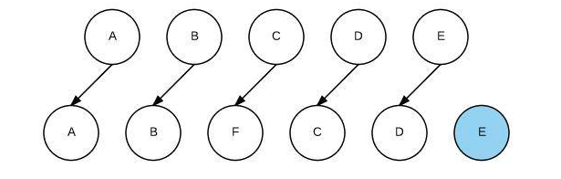
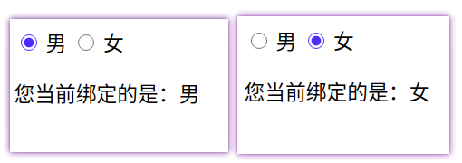
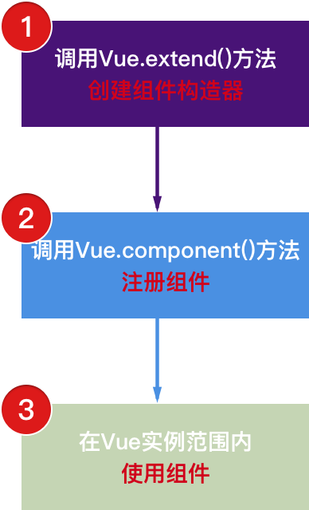

# Vue

## 1、简介 

Vue (读音 /vjuː/，类似于 **view**) 是一套用于构建用户界面的**渐进式框架**。与其它大型框架不同的是，Vue 被设计为可以自底向上逐层应用。Vue 的核心库只关注视图层，不仅易于上手，还便于与第三方库或既有项目整合。另一方面，当与现代化的工具链以及各种支持类库结合使用时，Vue 也完全能够为复杂的单页应用提供驱动。

**渐进式：**

- 可以将Vue作为应用的一部分嵌入其中，带来更丰富的交互体验。

==vue的核心库以及生态系统：Core+Vue+router+Vuex。==

**Vue特点：**

- 解耦视图与数据。
- 可复用的组件。
- 前端路由技术。
- 状态管理。
- 虚拟DOM。


## 2、安装

**2.1、直接引入vue.js文件：**

````
<script src="../js/vue.js"></script>
````

**2.2、使用cdn**

开发版本：有警告提示，但文件比生产版本大

```
<script src="https://cdn.jsdelivr.net/npm/vue/dist/vue.js"></script>
```

生产版本：删除提示信息，将文件进行了压缩

````
<script src="https://cdn.jsdelivr.net/npm/vue@2.6.12"></script>
````

使用原生的ES modules：

````
<script type="module">
  import Vue from 'https://cdn.jsdelivr.net/npm/vue@2.6.12/dist/vue.esm.browser.js'
</script>
````

npm(需要node,在webpack使用)：

````
npm install vue --save	
````

## 3、初体验

==Vue.js 的核心是一个允许采用简洁的模板语法来声明式地将数据渲染进 DOM 的系统：==

**hello world：**

````
<!DOCTYPE html>
<html lang="en">
<head>
    <meta charset="UTF-8">
    <title>Title</title>

</head>
<body>

<div id="app">{{ message }}</div>
<script src="../js/vue.js"></script>
<script type="application/javascript">
	// Vue是由Vue.js内提供的
    let app = new Vue({
    	// 挂载要管理的元素
        el: '#app', 
        data: {
            message: 'hello world'
        }
    });
</script>
</body>
</html>
````


**数组数据的输出：**

````
<!DOCTYPE html>
<html lang="en">
<head>
    <meta charset="UTF-8">
    <title>Title</title>
</head>
<body>
<div id="app">
    <ul>
        <li v-for="item in message">{{item}}</li>
    </ul>
</div>
<script src="../../js/vue.js"></script>
<script type="application/javascript">
    let app = new Vue({
        el: '#app',
        data: {
            message: ['盗梦空间','星际穿越','信条','米奇妙妙屋']
        }
    });
</script>
</body>
</html>
````


**Vue和原生js的区别：**

- 原生js（命令式编程）： 按照指令来编程，必须要给出命令才能执行操作。
- Vue（声明式编程）：   先声明再进行数据加载，可以先声明，在由Vue去对进行数据赋值。

**Vue是一个响应式框架，什么是响应式呢，就是数据发生了变化，页面也会跟着变化。**


**methods：**

- 可以进行数据计算。
- 用于处理复杂的算式和方法。

**计数器案例：**

````
<!DOCTYPE html>
<html lang="en">
<head>
    <meta charset="UTF-8">
    <title>Title</title>
</head>
<body>
<div id="app">
    <h2>当前的数字：{{ count }}</h2>
    <button v-on:click="add">加一</button>
    <button v-on:click="sub">减一</button>
    <!--不输出日志，只进行加数和减数时,methods不需要写-->
    <!-- @ 是 v-on 的 语法糖(简写) -->
    <button v-on:click="count++">加一</button>
    <button v-on:click="count--">减一</button>
</div>
<script src="../../js/vue.js"></script>
<script type="application/javascript">
    let app = new Vue({
        // 还可以传入htmlElement(内部会使用document.querySelector())
        el: '#app',
        // 定义数据 (Object or Function(函数))
        // 组件化中data，必须是一个函数
        data: {
            count: 0
        },
        methods: {
            add(){
                this.count++;
                console.log(this.count);
            },
            sub(){
                this.count--;
                console.log(this.count)
            }
        }
    });
</script>
</body>
</html>
````


## 4、MVVM

**什么是MVVM其实就是 Model View View	Model。**

==MVVM 就是将其中的View 的状态和行为抽象化，让我们将视图 UI 和业务逻辑分开，它可以取出 Model 的数据同时帮忙处理 View 中由于需要展示内容而涉及的业务逻辑。==


**计算器案例的MVVM：**


## 5、Vue生命周期

==生命周期：从诞生到凋零的过程。==

可以在Vue的生命周期之后调用钩子，在相应的位置执行方法。


## 6、mustache语法与指令

### 6.1、插值操作

#### 6.1.1、mustache语法

```
<div id="app">
  <h2>hello 前端 {{message}} hello vue</h2>
  <h2>{{first}} {{message}} {{last}}</h2>
  <!--可以在里面使用一些简单的算式（比如输出一个数据5倍 {{ 数据 * 5 }} ）-->
  <h2>{{first + ' ' + message + ' ' + last}}</h2>
</div>
<script src="../../js/vue.js"></script>
<script type="application/javascript">
	let app = new Vue({
		el: '#app',
		data: {
			first: 'hello 前端',
			message: 'hello world',
      last: 'hello vue'
		}
	});
</script>
```

#### 6.1.2、v-once

```
# 响应式
<h2>{{ message }}</h2>
# 第一次数据渲染之后，不在发生改变
<h2 v-once>{{ message }}</h2>
```


#### 6.1.3、v-html

==可以将标签以html的格式进行渲染，和真实的html字符串一致，以html的格式进行渲染。==

````
<div id="app">
  <h2 v-html="message"></h2>
</div>

<script src="../../js/vue.js"></script>
<script type="application/javascript">
	let app = new Vue({
		el: '#app',
		data: {
			message: '<a href="https://www.baidu.com">点击跳转到百度</a>'
		}
	});
</script>
````


#### 6.1.4、v-text(特殊场景使用)

==和mustache语法效果一致，以字符串的形式输出，但是没有mustache语法灵活。==

```` 
<!--效果一致-->
<h2 v-text="message"></h2> ==> <h2>{{message}}</h2> 

<!--message内的数据会覆盖 hello world，mustache可以拼接-->
<h2 v-text="message"> hello world</h2>  
````

#### 6.1.5、v-pre(特殊场景使用)

==不需要Vue进行挂载，就希望以字符串的格式输出。==


````
<div id="app">
  <h2>{{ message }}</h2>
  <h2 v-pre>{{ message }}</h2>
</div>

<script src="../../js/vue.js"></script>
<script type="application/javascript">
	let app = new Vue({
		el: '#app',
		data: {
			message: 'hello world'
		}
	});
</script>
````

#### 6.1.6、v-cloak(斗篷)

**v-cloak特性：**

- 加上v-cloak，在vue解析之前，会存在。
- 加上v-cloak，在vue解析之后，会自动删除。

**作用：**

当请求缓慢时，可能vue还没有进行赋值，就已经将代码进行输出了，此时就会出现`{{message}}`,过个几秒钟，变成`hello world`，这样对用户非常不友好,所以我们可以在样式中设置==存在v-cloak就进行隐藏,vue赋值之后会删除v-cloak，就又可以显示出来了==。

````
<!DOCTYPE html>
<html lang="en">
<head>
  <meta charset="UTF-8">
  <title>v-cloak</title>
  <style>
    [v-cloak]{
      display: none;
    }
  </style>
</head>
<body>

<div id="app">
  <h2 v-cloak>{{ message }}</h2>
</div>

<script src="../../js/vue.js"></script>
<script type="application/javascript">
	let app = new Vue({
		el: '#app',
		data: {
			message: 'hello world'
		}
	});
</script>
</body>
</html>
````

### 6.2、属性绑定

#### 6.2.1、v-bind基本使用

==v-bind语法糖-- **：**==

````
<div id="app">
  
  <!--语法糖的写法-->
  
</div>

<script src="../../../js/vue.js"></script>
<script type="application/javascript">
	let app = new Vue({
		el: '#app',
		data: {
			imageWidth: '500',
      		imageHeight: '300px',
			images: '图片地址'
		}
	});
</script>
````


#### 6.2.2、v-bind动态绑定class(对象语法)

````
<head>
  <meta charset="UTF-8">
  <title>v-bind动态绑定class(对象语法)</title>
  <style>
    .active{
      color: red;
    }
    .line{
      background: purple;
    }
    .ner{
      font-size: 20px;
    }
  </style>
</head>
<body>

<div id="app">
  <!--
  <h2 v-bind:class="active">{{ message }}</h2>
  <h2 v-bind:class="{ 类名1:boolean, 类名2:boolean }">{{ message }}</h2>
  <h2 v-bind:class="{active,isActive,line:isLine}">{{ message }}</h2>
  -->
  <!--绑定的class和普通的class会合并-->
  <!--  
  <h2 class="ner" v-bind:class="{active,isActive,line:isLine}">{{ message }}</h2>
  -->
  <!--可以和 @click 联合使用利用点击更改背景颜色-->
  <h2 class="ner" v-bind:class="returnClass()">{{ message }}</h2>
  <button @click="changeColor">改变颜色</button>

</div>

<script src="../../../js/vue.js"></script>
<script type="application/javascript">
	let app = new Vue({
		el: '#app',
		data: {
			isLine: true,
			line: 'line',
			isActive: true,
			active: 'active',
			message: 'hello world'
		},
    methods: {
		changeColor(){
			this.isLine = !this.isLine;
      },
     	returnClass(){
			return {active:this.isActive,line:this.isLine};
      }
    }
});
</script>
</body>
````

#### 6.2.3、v-bind动态绑定class(数组语法)

==将对象改成了数组，加上单引号则为字符串，不加单引号则为变量。==

````
<head>
  <meta charset="UTF-8">
  <title>v-bind动态绑定class(数组语法)</title>
  <style>
    .active{
      color: red;
    }
    .line{
      background: purple;
    }
    .ner{
      font-size: 20px;
    }
  </style>
</head>
<body>

<div id="app">
  <!--
  <h2 v-bind:class="active">{{ message }}</h2>
  <h2 v-bind:class="['字符串1','字符串2']">{{ message }}</h2>
  <h2 v-bind:class="[变量1,变量2]">{{ message }}</h2>
  -->
  <!--绑定的class和普通的class会合并-->
  <!--
  <h2 class="ner" v-bind:class="['字符串1','字符串2']">{{ message }}
  </h2>-->
  <h2 class="ner"  :class="returnClass()">{{ message }}</h2>
</div>
<script src="../../../js/vue.js"></script>
<script type="application/javascript">
	let app = new Vue({
		el: '#app',
		data: {
			line: 'line',
			active: 'active',
			message: 'hello world'
		},
		methods: {
			returnClass(){
				return [this.active,this.line];
			}
		}
	});
</script>
</body>
````

#### 6.2.4、v-bind动态绑定style(对象语法)

````
<div id="app">
  <!--  <h2 v-bind:style="{key(属性名):value(属性值)}">{{ message }}</h2>-->
  <!--
  属性名使用驼峰标识，并且可以不加单引号,
  属性值需要加上单引号，不加单引号是变量
  -->
  <!--  <h2 v-bind:style="{fontSize:'50px'}">{{ message }}</h2>-->
  <h2 v-bind:style="getStyle()">{{ message }}</h2>
</div>

<script src="../../../js/vue.js"></script>
<script type="application/javascript">
	let app = new Vue({
		el: '#app',
		data: {
			size: '100px',
			color: 'red',
			message: 'hello world'
		}, methods: {
			getStyle() {
				return {fontSize: this.size, color: this.color};
			}
		}
	});
</script>
````

#### 6.2.5、v-bind动态绑定style(数组语法)

````
<div id="app">
  <--
  就是将一个个的对象放进数组内。
  发现放在定义对象时value不能使用变量，使用变量发现没有生效。
  -->
  <h2 v-bind:style="[basicStyle01,basicStyle02]">{{ message }}</h2>
</div>

<script src="../../../js/vue.js"></script>
<script type="application/javascript">
	let app = new Vue({
		el: '#app',
		data: {
			basicStyle01:{fontSize:'50px'},
			basicStyle02:{color:'red'},
			message: 'hello world'			
		}
	});
</script>
````

## 7、计算属性

### 7.1、基本使用

==将计算后的数据以一个新的名字输出。==

````
<div id="app">
  <h2>{{fullName}}</h2>
</div>
<script src="../../../js/vue.js"></script>
<script type="application/javascript">
	let app = new Vue({
		el: '#app',
		data: {
			firstName: 'Jam',
      		lastName: 'kobe'
		},
    computed: {
    		// 调用了getter()方法
      	fullName:function (){
		  	return this.firstName + ' ' + this.lastName;
      	}
    }
	});
</script>
````


### 7.2、复杂操作

==使用计算属性进行了求数据总和，虽然methods也可以做，但是methods没有缓存，而computed有，计算属性性能会高一些。==

````
<div id="app" v-cloak>总价格：{{ totalPrice }}</div>

<script src="../../../js/vue.js"></script>
<script type="application/javascript">
	let app = new Vue({
		el: '#app',
		data: {
			books: [
        {id: 110,name: 'Unix编程艺术',price: 119},
        {id: 111,name: '代码大全',price: 105},
        {id: 112,name: '深入理解计算器系统',price: 98},
        {id: 113,name: '现代操作系统',price: 87},
      ]
		},
    computed: {
			 totalPrice: function (){
			 	let number = 0;
				 for (let book of this.books) {
				 	number += book.price;
				 }
				 return number;
       }
    }
	});
</script>
````


### 7.3、setter和getter


````
<div id="app">{{ fullName }}</div>

<script src="../../../js/vue.js"></script>
<script type="application/javascript">
	let app = new Vue({
		el: '#app',
		data: {
			firstName: '侠客行',
      lastName: '千里走单骑'
		},
    computed: {
            fullName:{
            // 一般情况是不写set方法的，不想让人去修改我们的数据,不写就只是一个只读属性
            // 修改修改数据时
            set:function (newValue){
				// newValue是从外部接收到的值，没有就只是只读属性,但是set内的方法还是可以执行
            },
            get:function (){
            return this.firstName + ' ' + this.lastName;
            }
      	}
    }
    
    <!--
    这个是上面计算属性的语法糖写法(只读)，默认调用的是get()
	computed: {
    	fullName: function (){
    		return this.firstName + ' ' + this.lastName;
    	}
	}
	-->  
});
</script>
````


### 7.4、计算属性缓存

**计算属性和方法的区别：**

- 计算属性存在缓存，只要调用时和上次一致，会直接使用缓存，性能更高。
- 方法是没有缓存机制的，每一次都会进入方法做，执行方法内的操作。

```
<div id="app">
  <h2 v-for="it in ['1','2','3']">{{ fullName }}</h2>
  <h2 v-for="it in ['1','2','3']">{{ getFullName() }}</h2>
</div>

<script src="../../../js/vue.js"></script>
<script type="application/javascript">
	let app = new Vue({
		el: '#app',
		data: {
			firstName: '侠客行',
			lastName: '千里走单骑'
		},
    	computed: {
			fullName: function (){
				console.log("输出了一次computed");
				return this.firstName + ' ' + this.lastName;
      		}
    	},
    	methods: {
			getFullName(){
				console.log("输出了一次methods");
				return this.firstName + ' ' + this.lastName;
      		}
    	}
	});
</script>
```


## 8、事件监听

### 8.1、v-on（语法糖@）

==v-on可以传入一个event的参数。==

**基本写法：**

````
<div>
	<h2>{{count}}</h2>
</div>
<button  v-on:click='count++'>加一</button>
<!--语法糖-->
<button  @click='count--'>减一</button>
````

**传入参数：**

- 在方法需要传入参数时，省略小括号，Vue默认会把event对象传过去。

```
<!--传入的对象为undefined-->
<button  @click='count()'>点击</button> 

<!--传入的对象为event-->
<button  @click='count'>点击</button>  

<!--methods方法-->
methods: {
 count(event){
 	//在需要传入参数时不传也不加上小括号，默认传event对象
 }
}
```

**当需要手动获取event对象时：==传入$event==，使用event时Vue会当成变量。**

### 8.2、v-on修饰符

**修饰符：**

- .stop（停止冒泡）：调用了event.stopPropagation()。
- .prevent（阻止默认事件）：调用event.preventDefault()。
- .{keyCode|KeyAlias}：只当事件是从特定键触发时才触发回调。
- .native：监听组件根元素的原生事件。
- .once：只触发一次。

````
<!--停止冒泡-->
<button @click.stop="stopPropagation()">点击</button>

<!--阻止默认行为-->
<button @click.prevent="stopDefault">点击</button>

<!--阻止默认行为-->
<form @submit.prevent></form>

<!--串联修饰符-->
<button @click.stop.prevent="doubleConnection">点击</button>

<!--键修饰符，键别名-->
<input @keyup.enter="onEnter"/>

<!--键修饰符，键代码-->
<input @keyup.13="onEnter"/>

<!--只有第一次点击有效-->
<button @click.once="firstClick">点击</button>
````

## 9、条件判断

==满足条件的DOM才可以渲染出来。==

### 9.1、v-if

````
<div id="app">
  <!--isSHow等于true则可以显示-->
  <h2 v-if="isShow">{{ message }}</h2>
</div>

<script src="../../../js/vue.js"></script>
<script type="application/javascript">
	let app = new Vue({
		el: '#app',
		data: {
			isShow: true,
			message: 'hello world'
		}
	});
</script>
````

### 9.2、v-else-if(不建议使用)

==当步骤比较复杂时，可以使用methods或computed代替，**计算用computed更好**。==

````
<div id="app">
  <h2 v-if="score >= 90">优秀</h2>
  <h2 v-else-if="score >= 80">良好</h2>
  <h2 v-else-if="score >= 60">及格</h2>
  <h2 v-else>不及格</h2>
</div>

<script src="../../../js/vue.js"></script>
<script type="application/javascript">
	let app = new Vue({
		el: '#app',
		data: {
			score: 89
		}
	});
</script>
````

### 9.3、v-else

````
<div id="app">
  <!--当isSHow等于 true 则可以显示-->
  <h2 v-if="isShow">{{ message }}</h2>
  <!--当isSHow等于 false 则可以显示-->
  <h2 v-else>{{ message }}</h2>
</div>

<script src="../../../js/vue.js"></script>
<script type="application/javascript">
	let app = new Vue({
		el: '#app',
		data: {
			isShow: true,
			message: 'hello world',
			content: 'hello 前端'
		}
	});
</script>
````

### 9.4、input的小问题

**问题描述：当给input使用v-if和v-else时，发现点击切换后，数据不会自动消失。**

**代码：**

````
<div id="app">
  <span v-if="isChange">
    <label for="user">用户名：</label>
    <input id="user" type="text" placeholder="用户名"/>
  </span>
  <span v-else>
    <label for="email">邮箱：</label>
    <input id="email" type="text" placeholder="邮箱"/>
  </span>
  <button type="button" @click="isChange = !isChange">切换</button>
</div>

<script src="../../../js/vue.js"></script>
<script type="application/javascript">
	let app = new Vue({
		el: '#app',
		data: {
			isChange: true
		}
	});
</script>
````


**原因：**

- Vue会先将显示的数据放在内存中（虚拟DOM），在进行渲染。
- 出于性能的考虑，Vue会尽可能的复用之前的元素，而不是创建新的元素。
- .切换input时，只是修改一部分的数据，但其实仍然调用的是user的这个input。


**解决：**在input加上一个key的标识，vue在复用对比时，发现key不一致，就会重新创建。

````
  <span v-if="isChange">
    <label for="user">用户名：</label>
    <input id="user" type="text" placeholder="用户名" key="user"/>
  </span>
  <span v-else>
    <label for="email">邮箱：</label>
    <input id="email" type="text" placeholder="邮箱" key="email"/>
  </span>
  <button type="button" @click="isChange = !isChange">切换</button>
````

### 9.5、v-show

==和v-if非常相似，都是决定一个元素是否渲染。==

v-if和v-show使用：

- v-if当条件为false，整个DOM就直接被删除了。
- v-show条件为false时，只是将DOM隐藏,display设置为了none。

选择：

- 需要显示和隐藏切换非常频繁时，使用v-show。
- 当只有一次切换时,通过v-if。

````
<div id="app">
  <h2 v-if="isShow" id="v-if">{{ message }}</h2>
  <h2 v-show="isShow" id="v-show">{{ message }}</h2>
</div>

<script src="../../../js/vue.js"></script>
<script type="application/javascript">
	let app = new Vue({
		el: '#app',
		data: {
			isShow: false,
			message: 'hello world'
		}
	});
</script>
````


## 10、循环遍历

### 10.1、v-for遍历数组

````
<div id="app">
  <ul>
    <!--没有使用索引值,直接遍历数组-->
    <li v-for="book in books"> {{book}} </li>
  </ul>
  <p>------------------------------------</p>
  <ul>
    <!--可以获取当前元素的下标值，进行输出-->
    <li v-for="(book,index) in books"> {{index}}-{{book}} </li>
  </ul>
</div>

<script src="../../../js/vue.js"></script>
<script type="application/javascript">
	let app = new Vue({
		el: '#app',
		data: {
			books: ['计算机组成原理','Java疯狂讲义','数据结构与算法','代码大全']
		}
	});
</script>
````


### 10.2、v-for遍历对象

````
<div id="app">
  <h2>
    <ul>
      <!--只获取 value -->
      <li v-for="book in books">{{book}}</li>
      <p>-------------------</p>
      <!--获取 value 和 key 格式(value,key) -->
      <li v-for="(value,key) in books">{{value}} -- {{key}}</li>
      <!--获取 value key 和 index 格式(value,key,index) -->
      <p>-------------------</p>
      <li v-for="(value,key,index) in books">{{value}} -- {{key}} -- {{index}}</li>
    </ul>
  </h2>
</div>

<script src="../../../js/vue.js"></script>
<script type="application/javascript">
	let app = new Vue({
		el: '#app',
		data: {
			books: {
				id: 1001,
        name: '代码大全',
        price: '119'
      }
		}
	});
</script>
````


### 10.3、v-for绑定key的原因

==官方推荐再使用v-for时，给对应的元素或组件加上一个:key属性，key的作用是为了高效的更新虚拟DOM。==

**不加key：**




**加上key：**


**原因：**

- Vue内部插入数据使用diff算法，当我们在第三个位置插入F时，它会将第三个元素改成F，第四个元素改成C，以此类推在增加一个li，改成E，性能极地。

- 加上key，就相当于给每一个li加上了标识，当插入一个新的元素时，它会创建一个新的li插入到指定的位置，而不会在去修改其他的元素。

**key内的数据不能为index，index只是绑定的数组的下标，当插入F之后，此时C的下标为3，后续的元素仍然需要改变，没有意义，应该使用数组中不会发生变化的那一项。**

````
<!--有ID尽量使用ID-->
<li v-for="book in books" :key="book.id">{{book}}</li>
<!--没有ID，使用key，不能重复-->
<li v-for="(book,key) in books" :key="key">{{book}}</li>
<!--不要使用index没什么用-->
<li v-for="(book,key,index) in books" :key="index">{{book}}</li>
````

## 11、响应式数组

==通过索引值修改元素的方式不是响应式的。==

**可以做到响应式的方法：**

1、push()：在最后增加一个或多个数据。

2、pop()：删除最后一个元素。

3、shift()：删除第一个元素。

4、unshift()：在最前面添加一个或多个元素。

5、splice()：**可以插入/删除/替换元素**

- 插入元素：splice(1,0,'a','b','c')：第一个表示开始的位置，0表示不删除元素，后面的数据为增加的数据。

- 删除元素：splice(1,2) ：第一个表示表示开始的位置，第二个表示删除的个数。
- 替换元素：splice(2,2,'x','y','z')：第一个表示表示开始的位置，第二个为替换的个数，后面为替换的数据。

6、sort()：排序。

7、reverse()：反转。

## 12、过滤器的使用

很简单。

````
<td style="width: 50px;">{{book.price | getPrice}}</td>

// Vue中
filters: {
	getPrice (price) {
		return '￥' + price.toFixed(2);
    }
}
````


## 13、JavaScript高阶函数的使用

### 13.1、filter

==filter的作用：过滤掉不符合条件的数据，将符合条件的数据存储到新的数组并进行返回，并没有对元数组进行操作，只是进行了遍历。==

```
let nums = [10,20,30];
// nums.filter(需要一个回调函数)，回调函数有一个要求，返回的类型必须为boolean;
// 返回的true就会将数据存入一个新的数组，返回的false就会舍弃掉，最后返回新的数组。
示例：

let newNums = num.filter(function(n){	//n为传入的数据(数组内的数据).
	if(n < 25){
		return true;
	}
	return false;
});

结果：newNums内的值就会为 10和20.
```

### 13.2、map

==map的作用：对数据进行处理，再存储到一个新的数组内，进行返回。==

````
let nums = [10,20,30];
// 将数据进行操作，在存储到新的数组进行返回。
let newNums = nums.map(function(n){	//n为传入的数据(遍历的数组元素)
 return n * 5;
});
结果：新的数组内的数据为nums每个元素的5倍.
````

### 13.3、reduce

==reduce的作用：将数据进行汇总(加减乘除的计算)。==

````
let nums = [10,20,30];

//preValue为前一个计算出的值，n为传入的数据(遍历的数组元素)
let new = nums.reduce(function(preValue,n){
	//计算出的值为下一个计算preValue的值
	return preValue + n; 
},0); 	//0为初始值，因为第一个操作时，返回的数据不存在
结果：new为数组元素全部相加后的数据为60.
````

### 13.4、联合使用

````
let nums = [10,20,30]
// 不使用箭头函数
let total = nums.filter(function(n){
	return n < 25;
}).map(function(n){
	return n * 5;
}).reduce(function(preValue,n){
	return preValue + n;
},0);
// 使用箭头函数
let total = nums.filter(n => n < 25)
.map(n => n * 5)
.reduce((preValue,n)=> preValue + n);
````

## 14、表单绑定

### 14.1、v-model双向绑定

==双方都可以修改对方的值。==


```
<div id="app">
  <label for="data"></label>
  <!--input内的数据和data的message进行了绑定，任何一方进行更改，数据都会发生变化。-->
  <input type="text" id="data" v-model="message"/>
</div>

<script src="../../../js/vue.js"></script>
<script type="application/javascript">
	let app = new Vue({
		el: '#app',
		data: {
			message: 'hello world'
		}
	});
</script>
```


### 14.2、v-model原理

**v-model其实是`:value`和`@input`的集合体。**

:value： 动态的将数据传入input。

:@input： input内部的事件，监听用户的输入。

````
<!-- 
	:value="message":当data内的message发生变化后，
	 input内的数据也会同步发生变化 
-->

<!-- 
	@input=" messgae = $event.target.value":
	将input内输入的数据赋data内的messgae
	
	$event.target.value为input内最新的输入数据
-->

<input type="text" :value="message" 
@input=" messgae = <div id="app">
  <input type="radio" id="male" v-model="sex" value="男">
  <label for="male">男</label>
  <input type="radio" id="female" v-model="sex" value="女">
  <label for="female">女</label>
  <p>您当前绑定的是：{{sex}}</p>$event.target.value" /> 
等同于  <input type="text" v-model="message">
````

### 14.3、v-model结合radio

==当使用radio时，两个radio的v-model绑定的是同一个数据，name可以直接省略，也是可以实现单选框的。==

````
<div id="app">
  <input type="radio" id="male" v-model="sex" value="男">
  <label for="male">男</label>
  <input type="radio" id="female" v-model="sex" value="女">
  <label for="female">女</label>
  <p>您当前绑定的是：{{sex}}</p>
</div>

<script src="../../../js/vue.js"></script>
<script type="application/javascript">
	let app = new Vue({
		el: '#app',
		data: {
      sex: '男'
		}
	});
</script>
````



### 14.4、v-model结合checkbox使用

#### 14.4.1、单选框

使用场景：类似同意协议

````
<div id="app">
  <!--只有当点上同意协议才能进行下一步-->
  <input type="checkbox" id="agree" v-model="isAgree"/>
  <label for="agree">同意协议</label>
  <button :disabled="!isAgree">下一步</button>
</div>

<script src="../../../js/vue.js"></script>
<script type="application/javascript">
	let app = new Vue({
		el: '#app',
		data: {
			isAgree: false
		}
	});
</script>
````


#### 14.4.2、多选框

```
<div id="app">
  <input type="checkbox" id="basketball" value="篮球" v-model="likes">
  <label for="basketball">篮球</label>
  <input type="checkbox" value="排球" id="volleyball" v-model="likes">
  <label for="volleyball">排球</label>
  <input type="checkbox" value="足球" id="football" v-model="likes">
  <label for="football">足球</label>
  <input type="checkbox" value="网球" id="tennis-ball" v-model="likes">
  <label for="tennis-ball">网球</label>
  <input type="checkbox" value="乒乓球" id="table-tennis" v-model="likes">
  <label for="table-tennis">乒乓球</label>
  <h2>你选择的爱好：{{likes}}</h2>
</div>

<script src="../../../js/vue.js"></script>
<script type="application/javascript">
	let app = new Vue({
		el: '#app',
		data: {
			likes: []
		}
	});
</script>
```


### 14.5、v-model结合select使用

==现在基本上用的非常少了。==

#### 14.5.1、选择单个

````
<div id="app">
  <label for="fruit">水果：</label>
  <select name="fruit" id="fruit" v-model="fruit">
    <option>苹果</option>
    <option>李子</option>
    <option>香蕉</option>
    <option>葡萄</option>
    <option>水蜜桃</option>
  </select>
  <h2>您选择了：{{fruit}}</h2>
</div>

<script src="../../../js/vue.js"></script>
<script type="application/javascript">
	let app = new Vue({
		el: '#app',
		data: {
			fruit: '苹果',
		}
	});
</script>
````


#### 14.5.2、选择多个

````
<div id="app">
  <label for="foods">食物：</label>
  <select name="foods" id="foods" v-model="foods" multiple>
    <option>白切鸡</option>
    <option>叫花鸡</option>
    <option>脆皮鸡</option>
    <option>大盘鸡</option>
    <option>烧鸡</option>
  </select>
  <h2>您选择的食物：{{foods}}</h2>
</div>

<script src="../../../js/vue.js"></script>
<script type="application/javascript">
	let app = new Vue({
		el: '#app',
		data: {
      		foods: []
		}
	});
</script>
````


### 14.6、值绑定

==就是value的值不写死，用后台传递过来的数据进行渲染，**动态的给value赋值**。==

````
<div id="app">
  <label :for="fruit" v-for="fruit in fruits">
  	<!-- :value="fruit": value不是写死的，数据是由后台传递,在页面进行渲染在上面的 -->
    <input type="checkbox" :value="fruit" :id="fruit" v-model="likes">{{fruit}}
  </label>
  <h2>您喜欢吃的水果是：{{likes}}</h2>
</div>

<script src="../../../js/vue.js"></script>
<script type="application/javascript">
	let app = new Vue({
		el: '#app',
		data: {
			// 后台传递的数据
			fruits: ['苹果','梨子','香蕉','葡萄','西瓜'],
      		likes: []
		}
	});
</script>
````


### 14.7、v-model修饰符

#### 14.7.1、lazy

 ````
<!-- lazy：只有敲回车或失去光标时，进行双向绑定-->
<input type="text" v-model.lazy="message">
 ````

#### 14.7.2、number

````
<!-- number：v-model在赋值时默认为String类型，
	 将input设置为number是没有任何作用的,只要输入了值，
	 默认会转成string类型,可以加上修饰符number,数字不会自动转字符串 ->

<!-- 用了number，开头为数字，后面写的非数字会直接进行删除，
	 而开头为非数字，后面会直接当成string类型 ->
<input type="text" v-model.number="message">
````

#### 14.7.3、trim

````
<!-- trim：对于输入的数据删除左右两边的空格，在进行数据绑定-->
<input type="text" v-model.trim="message">
````

## 15、组件化开发

==组件化是vue的重要思想。==


**组件化的思想的应用：**

- 有了组件化的思想，我们在之后的开发中就要充分的利用它。
- 尽可能的将页面拆分成一个个小的、可复用的组件。
- 组件化的代码可以更加方便组织和管理，并且扩展性也更强。

### 15.1、组件注册

**组件的注册过程：**

- 创建组件构造器。

- 注册组件。
- 使用组件。



#### 15.1.1、注册全局组件(用的少)

==全局组件可以在多个vue实例中使用，但开发中一般只用一个vue实例。==

````
<div id="app">
  <my-cpn></my-cpn>
  <my-cpn></my-cpn>
  <my-cpn></my-cpn>
</div>

<script src="../../../js/vue.js"></script>
<script type="application/javascript">
  const cpn = Vue.extend({
    template: `
      <div>
        <h2>注册组件</h2>
      </div>
    `
  });
  Vue.component("my-cpn",cpn);

	let app = new Vue({
		el: '#app',
		data: {
			message: 'hello world'
		}
	});
</script>
````


#### 15.1.2、注册局部组件

==在vue实例内注册组件。==

````
<div id="app">
  <cpn></cpn>
  <cpn></cpn>
  <cpn></cpn>
  <cpn></cpn>
</div>

<script src="../../../js/vue.js"></script>
<script type="application/javascript">
  const cpn = Vue.extend({
    template: `
      <div>
        <h2>注册组件</h2>
      </div>
    `
  });
  let app = new Vue({
  	el: '#app',
  	data: {
  		message: 'hello world'
  	},
  	components: {
  		cpn
  	}
  });
</script>
````


#### 15.1.3、注册组件语法糖

````
<script type="application/javascript">
	let app = new Vue({
		el: '#app',
		data: {
			message: 'hello world'
		},
    components:{
    	// 直接在里面写template，它内部还是调用了Vue.extend，只是我们看不到而已。
		  cpn:{
		  	template:`
		  	<div>
		  	  <h2>我是使用语法糖的逐渐注册方式!</h2>  
        </div>
		  	`
      }	
    }
	});
</script>
````

#### 15.1.4、模板分离

==模板中，html元素过多时，必须要使用一个div包裹，作根元素，超过html元素就加。==

````
<!-- 第一种分离方式 -->
<script type="text/x-template" id="cpn1">
	<div>
		<h2>我是第一种分离方法</h2>
	</div>
</script>
````

````
<!--第二种分离方法-->
<template id="cpn2">
	<div>
		<h2>我是第二种分离方法</h2>
	</div>
</template>
````

**注册：**

````
<script src="../../../js/vue.js"></script>
<script type="application/javascript">
	let app = new Vue({
		el: '#app',
		data: {
			message: 'hello world'
		},
		components: {
			// 注册第一种分离方式的模板
			cpn1: {
				template: '#cpn1',
      		},
			// 注册第二种分离方式的模板
			cpn2: {
				template: '#cpn2',
			}
    	}
	});
</script>
````

### 15.2、组件访问Vue实例数据吗?

#### 15.2.1、数据存放问题

- 组件是一个功能模块的封装，有自己的HTML模板也应该有自己的data数据。
- **==组件不可以访问Vue实例内的数据，可以访问自己组件内的data数据。==**

**组件既然不能访问Vue实例数据，那应该怎么获取数据呢？**

- 组件和Vue十分相似，所以它也有是自己的生命周期函数，自然也有自己的data属性存放数据。

- 组件中的data属性和Vue的data属性不太一致，组件内的data属性需要是一个函数，并返回一个对象，数据在对象中定义。


#### 15.2.2、组件内data为什么是函数?

1、组件是可复用的，data是函数主要是好返回内存地址不同的对象，组件指向的内存地址不同才可以保证修改的数据是独立的，只有自己的数据改变，而其他组件的数据不会发生改变。

2、如果组件中的data不是函数而是一个对象的话，那么复用组件将会指定同一个对象，因为他们指向的内存地址都是同一个对象，这就会导致数据共享的，只要有一个组件修改了数据，其他组件的数据也会跟着变化，即使这个组件的数据不能变化。


```
<div id="app">
  // 使用三个组件，data函数每一次都会返回一个对象，但是每一个对象的地址都是不一致的
  // 所以三个获取的数据，其实是指向不同的内存地址的，内存地址不同，修改的数据就不会共享。
  <cpn></cpn>
  <cpn></cpn>
  <cpn></cpn>
</div>

<template id="cpn">
  <div>
    <h2>当前数据：{{count}}</h2>
    <button @click="decrement">-</button>
    <button @click="increment">+</button>
  </div>

</template>
<script src="../../../js/vue.js"></script>
<script type="application/javascript">
	let app = new Vue({
		el: '#app',
		data: {
			message: 'hello world'
		},
    	components: {
			cpn: {
				template: '#cpn',
        	data(){
            	return{
                	count: 0
          		}
        	},
        	methods: {
            	increment(){
            		this.count ++;
          		},
            	decrement(){
          			this.count --;
          		}
        	}
      	}
    }
});
</script>
```

### 15.3、父子组件

#### 15.3.1、父子组件注册

**==如果A组件在B组件中注册，那么A组件就是B组件的子组件，B组件是A组件的父组件。==**

==父组件必须要在子组件的下面定义，否则获取不到子组件。==


```
<div id="app">
  <cpn2></cpn2>
</div>

<script src="../../../js/vue.js"></script>
<script type="application/javascript">
  // 子组件,因为只在cpn2中注册了，所以作用域是cpn2，想要在vue实例中使用，必须在vue实例中注册。
  const cpn1 = Vue.extend({
    template: `
      <div>
        <h2>我是cpn1组件</h2>
      </div>
    `es/2020/08/08/bodyImage
  });
  //父组件
	const cpn2 = Vue.extend({
		template: `
      <div>
        <h2>我是cpn2组件</h2>
        <cpn1></cpn1>
      </div>
    `,
    	components: {
			cpn1
    	}
	});
  
	// 根组件
	let app = new Vue({
		el: '#app',
		data: {
			message: 'hello world'
		},
        components:{
        	cpn2
    	}
	});
</script>
```


#### 15.3.2、父子组件通信

==子组件是不能引用父组件或Vue实例的数据的，但是开发中子组件肯定是要有数据的，我们不可能让每一个子组件都进行一次网络请求，这对服务器压力太大了，但又需要数据，我们可以让父组件统一进行网络请求，在让父组件向子组件传递数据。==


**1、父传子**

**props的两种写法：**

- 字符串数据，数组中的字符串就是传递时的名称。
- 对象，对象可以设置传递的类型，也可以设置默认值等。

**props字符串数据传递：**

````
<div id="app">
  <!--组件名上面绑定-->
  <cpn :cmessage="message"></cpn>
</div>

<template id="cpn">
  <div>
    <h2 >{{cmessage}}</h2>
  </div>
</template>

<script src="../../../js/vue.js"></script>
<script type="application/javascript">
  	const cpn = {
  		template: '#cpn',
    	props: ['cmessage'],
  	}

	const app = new Vue({
		el: '#app',
		data: {
			message: 'hello world'
		},
    	components: {
			cpn
    	}
	});
</script>
````

**props对象传递：**

支持的验证类型：

- String
- Number
- Boolean
- Array：默认值必须为函数，在返回一个数组`default() {return []}`。
- Object：默认值必须为函数，在返回一个数据`default() {return{}}`。
- Date
- Function
- Symbol

````
<div id="app">
  <cpn :cmessage="message"></cpn>
</div>

<template id="cpn">
  <div>
    <h2>{{cmessage}}</h2>
  </div>
</template>

<script src="../../../js/vue.js"></script>
<script type="application/javascript">
  const cpn = {
  	template: '#cpn',
    props: {
  		// 第一种，直接指定类型
  		// cmessage: String

		// 第二种，指定更多的数据
      	cmessage: {
         // type: String,         //指定类型
         	type: ['String','Number'] //指定多种类型
        	default: '我是默认值',  //设置默认值
        	required: true        //非空，使用组件必须向它传值
      	}
    }
 }
	const app = new Vue({
		el: '#app',
		data: {
			message: 'hello world'
		},
		components: {
			cpn
		}
	});
</script>
````

**自定义验证：**

````
props: {
  vaildator(value){
  	return ['success','error'].indexOf(value) !== -1;
  }
}
````

**驼峰标识：**

````
<div id="app">
  <!-- 
  cMessage需要获取传递的数据需要写成 c-message,否则获取不到数据
  -->
  <cpn :c-message="message"></cpn>
</div>

<template id="cpn">
  <div>
  	<!-- 获取到了数据才可以输出数据 -->
    <h2>{{cMessage}}</h2>
  </div>
</template>

<script src="../../../js/vue.js"></script>
<script type="application/javascript">
  const cpn = {
  	template: '#cpn',
    props: {
    	// vue其实是不支持驼峰命名的，直接赋值是获取不到数据的
		cMessage: String
  	}
 }
 const app = new Vue({
 	el: '#app',
	data: {
    	message: 'hello world'
	},
</script>
````

**2、子传父(自定义事件)**

````
<div id="app">
  // 监听自定义事件
  <cpn @category-click="sendData"></cpn>
</div>


<template id="cpn">
  <div>
    <button v-for="category in categories" 
    @click="categoryClick(category)">{{category.name}}</button>
  </div>
</template>
<script src="../../../js/vue.js"></script>
<script type="application/javascript">
	const cpn = {
		template: '#cpn',
		data() {
			return {
				categories: [
					{id: 1001, name: 'fruits'},
					{id: 1002, name: 'foods'},
					{id: 1003, name: 'clothes'},
					{id: 1004, name: 'shoes'},
				]
			}
		},
		methods: {
			categoryClick(category) {
				// 将事件传递到父组件
				// 第一个为父组件需要监听的事件，第二个是传输的数据
        		this.$emit('category-click',category);
			}
		}
	}
	let app = new Vue({
		el: '#app',
		data: {
			message: 'hello world'
		},
		components: {
			cpn
		},
    	methods: {
    		// 监听到子组件的方法（如果子组件传入了数据,category就有数据）
			sendData(category){
				console.log(category.id,category.name);
      	}
    }
});
</script>
````


#### 15.3.3、父子组件访问

**1、$children(父访问子)**

- 可以获取所有的子组件，用数组进行存储

````
this.$children.方法||data内的数据 等等。 // 一般不使用这个去拿，它需要用下标值拿
````

**2、$refs(父访问子)**

- 默认this.$ref是什么都没有的。
- 在组件上写`ref='xxx'`，使用`this.$ref.xxx.方法|数据 等等`才可以拿到。

**3、$parent(子访问父,不建议使用，耦合度太高)**

- 使用`this.$parent.方法|数据 等等`，非常简单。

**4、$root(vue实例)**

- 使用`this.$root`，可以获取根组件的信息。

## 16、插槽slot

### 16.1、slot简介

==增加扩展性。==

- 增强组件的可扩展性，将共性抽取到组件，不相同的则使用插槽。
- 预留的插槽可以根据使用者自己的需求，决定插槽的内容。


### 16.2、匿名插槽

````
<div id="app">
  <!--匿名插槽，没有指定名字，会将所有的插槽都修改成这个-->
  <cpn>
  	<button>我是插槽点击我</button>
  </cpn>
</div>

<template id="cpn">
  <div>
    <h2>我是h2</h2>
    <!-- 使用插槽就直接加上这个东西，没加默认值，不写就不会显示出来 -->
    <slot></slot>
    <slot><button>当你不填充时，我就会显示出来</button></slot>
  </div>
</template>
<script src="../../../js/vue.js"></script>
<script type="application/javascript">
  const cpn = {
  	template: '#cpn',
  }
	let app = new Vue({
		el: '#app',
    components: {
			cpn
    }
	});
</script>
````


### 16.3、具名插槽

#### 16.3.1、旧版具名插槽

当我们使用插槽时，组件内不可能只使用一个插槽，但是当我们需要填充插槽时，怎么知道填充的一定是我们想要填充的，这时候就可以使用具名插槽了，我们可以为插槽指定名字然后进行修改。


````
<div id="app">
  <cpn>
  	<button>我想修改中间的插槽</button>
  </cpn>
</div>

<template id="cpn">
  <div>
    <!--
    当我们想要修改中间的插槽时，直接修改无法知道修改一定是中间
     -->
    <slot><span>我是右边</span></slot>
    <slot><span>我是中间</span></slot>
    <slot><span>我是左边</span></slot>
  </div>
</template>
<script src="../../../js/vue.js"></script>
<script type="application/javascript">
	let app = new Vue({
		el: '#app',
		data: {
			message: 'hello world'
		},
    components: {
			cpn: {
				template: '#cpn'
      }
    }
	});
</script>
````

**指定名字设置插槽：**


````
<div id="app">
  <cpn>
  	<button slot="center">我想修改中间的插槽</button>
  </cpn>
</div>

<template id="cpn">
  <div>
    <!--
    当我们想要修改中间的插槽时，发现无法知道修改一定是中间
     -->
    <slot><span>我是右边</span></slot>
    <slot name="center"><span>我是中间</span></slot>
    <slot><span>我是左边</span></slot>
  </div>
</template>
<script src="../../../js/vue.js"></script>
<script type="application/javascript">
	let app = new Vue({
		el: '#app',
		data: {
			message: 'hello world'
		},
    components: {
			cpn: {
				template: '#cpn'
      }
    }
	});
</script>
````

#### 16.3.2、新版v-slot的使用

v-slot主要是来替代slot（具名插槽）和slot-scope（作用域插槽）的,v-slot只能加载在template上。

==v-slot的语法糖：#==

````
<div id="app">
  <cpn>
  
  	<!--
  	只能使用template，v-slot也绑定在template
 	有多个插槽需要修改时，定义多个template修改
  	-->
    <template v-slot:center>
      <button>点击我</button>
    </template>
    
    <!-- #号是v-slot的语法糖写法 -->
    <template #left>
      <button>我变成了按钮</button>
    </template>
  </cpn>
</div>

<template id="cpn">
  <div>
    <slot name="left"><span>我是左边</span></slot>
    <slot name="center"><span>我是中间</span></slot>
    <slot name="right"><span>我是右边</span></slot>
  </div>
</template>
````


### 16.4、作用域插槽

#### 16.4.1、旧版作用域插槽

==父组件替换子组件的插槽，但是内容由子组件提供。==

当父组件想更改插槽的样式时，子组件内的数据其实是拿不到，子组件必须将数据传上去，让父组件可以获得。

````
<div id="app">
  <cpn></cpn>
  <!--<div id="app">
  <cpn></cpn>
  <!--
   想修改数据的展示样式，但因为数据是子组件的，获取不到
   但可以使用slot-scope定义变量，获取传递的数据
   -->
  <cpn>
    <template slot-scope="slot">
    	<!-- 在每个数据内容之间加上一个 - 连接 -->
        <span>{{slot.languages.join(" - ")}}</span>
    </template>
  </cpn>
  <cpn></cpn>
</div>

<template id="cpn">
  <div>
    <!-- 
    可以使用作用域插槽将数据传给父组件
    v-bind:languages(给父组件使用的)="languages(传递的数据)"
    -->
    <slot :languages="languages">
      <ul>
        <li v-for="language in languages">{{language}}</li>
      </ul>
    </slot>
  </div>
</template>

<script src="../../../js/vue.js"></script>
<script type="application/javascript">
	let app = new Vue({
		el: '#app',
		components: {
			cpn: {
				template: '#cpn',
				data(){
					return{
						languages: ['Java','C++','C','JavaScript','PHP','C#']
					}
				}
			}
		}
	});
</script>
   想修改数据的展示样式，但因为数据是子组件的，获取不到,
   需要使用slot.scope，接收传递的数据。
   不知道是不是废弃的原因，没有效果,几个月学习的使用可以用的，新版不能用了
   -->
  <cpn>
  	<!-- 要使用template，div这个组件直接不显示了 -->
    <template slot-scope="slot">
      <span v-for="language in slot.languages">{{language}} -</span>
    </template>
  </cpn>
  <cpn></cpn>
</div>

<template id="cpn">
  <div>
    <!-- 可以使用作用域插槽将数据传给父组件 -->
    <slot :data="languages">
      <ul>
        <li v-for="language in languages">{{language}}</li>
      </ul>
    </slot>
  </div>
</template>

<script src="../../../js/vue.js"></script>
<script type="application/javascript">
	let app = new Vue({
		el: '#app',
		components: {
		.
		
		
			cpn: {
				template: '#cpn',
				data(){
					return{
						languages: ['Java','C++','C','JavaScript','PHP','C#']
					}
				}
			}
		}
	});
</script>
````

#### 16.4.2、新版作用域插槽

==v-slot整合了slot和slot-scope。==

````
<div id="app">
  <cpn>
  	<!-- 直接将slot和slot-scope进行了整合 -->
    <template #language="languages">
      <span v-for="language in languages">{{language.join(' - ')}}</span>
    </template>
    
    <template slot="language" slot-scope="languages">
      <span v-for="language in languages">{{language.join(' - ')}}</span>
    </template>
  </cpn>
</div>

<template id="cpn">
  <div>
    <slot name="language" :languages="languages">
      <ul>
        <li v-for="language in languages">{{language}}</li>
      </ul>
    </slot>
  </div>
</template>

<script src="../../../js/vue.js"></script>
<script type="application/javascript">
	let app = new Vue({
		el: '#app',
    components: {
			cpn: {
				template: '#cpn',
        data(){
          return {
          	languages: ['Java','C++','JavaScript','C','Lua']
          }
        }
      }
    }
	});
</script>
````

## 17、ES模块的导入与导出

**export(导出) / import(导入)**

````
<!--
	加上type="module"表示这个用模块封装了，
	不会出现命名冲突的问题，
	但其他文件也无法使用这个文件的数据
-->
<script src="a.js" type="module"></script>
````

**导出：**

方式一：

````
let flag = true;
function sum(num1,num2){
	return num1 + num2;
}
export {	//导出 flag 和 sum
	flag,sum
}
````

方式二：

````
export let flag = true;
````

方式三：导出函数和类

````
// 导出函数
export function sum(num1,num2){
	return num1 + num2;
}
// 导出类
export class People{
	run(){
		console.log("跑！！！");
	}
}
````

**export default：每个模块只能有一个**

````
// export default const address = "湖南省";
export default function sum(num1,num2){
	return num1 + num2;
}
````

**导入：**

方式一：

```
import {flag,sum} from './demo.js';
```

**方式二：导入默认的数据：可以自己定义名字**

````
// import addr from "./demo.js"
import dataSum from "./demo.js"
````

方式三：统一导入数据

````
import * as demo from "./demo.js";
// 使用：
console.log(demo.flag);
demo.sum(1,2);
````

## 18、webpack

### 18.1、认识webpack

从本质上来说，webpack是现代JavaScript应用的静态**模块打包**工具。

核心：让我们可以进行模块化开发，并且帮助我们处理模块间的依赖关系(把代码转成浏览器可以识别的代码)。


### 18.2、安装webpack

#### 18.2.1、安装node.js

webpack需要运行必须要在node环境下运行，node有很多依赖包，可以用一个包管理工具npm来处理(node自带)。

**ubuntu：**

````
apt-get install node.js
````

**centos：**

````
yum -y install node.js
````

**查看node版本：**

````
node -v
````

#### 18.2.2、安装webpack

**Linux可能还需要安装npm,使用`npm -v` 看是否存在npm。**

ubuntu:

````
apt-get install npm
````

centos:

````
yum -y install npm
````

````
# 指定了版本为3.6.0 可以下载最新的版本 
# 3.6.0是Cli2所依赖的版本
# 请使用root/Admin权限

npm install webpack@3.6.0 -g 
````

### 18.3、使用webpack

webpack使用了模块化的思想，它可以将文件的依赖自动打包成一个文件，引入文件即可。


````
# 前提：进入需要打包的项目内
例： webpack ./src/js/main.js ./dist/build.js # 可以根据实际情况修改 
````

**main.js：**

```
// webpack会自动加载依赖
import {sum,mul} from './mathUtil'

console.log(sum(1,2));
console.log(mul(2,3));
```

### 18.4、webpack配置

#### 18.4.1、webpack.config.js

==名字不能更改==

````
// path 是 node内的一个函数
const path = require('path');
module.exports = {
	// 入口
	entry: './src/js/main.js',
	output: {
			// path 必须是一个绝对路径 resolve是node内的一个函数，用于拼接
			// __dirname 是当前文件的绝对路径
			path: path.resolve(__dirname,"dist"),
			filename: 'build.js'
	}
}
````

配置完webpack.config.js之后就可以直接使用`webpack`这个命令进行打包了。

````
tan@dark:/software/webstormProject/VueStudent/VueLearn03-Webpack/01-Webpack的使用/002 webpack的配置$ webpack
Hash: fbf2380aebde3e1cd7b1
Version: webpack 3.6.0
Time: 35ms
   Asset     Size  Chunks             Chunk Names
build.js  3.27 kB       0  [emitted]  main
   [0] ./src/js/main.js 81 bytes {0} [built]
   [1] ./src/js/mathUtil.js 123 bytes {0} [built]
````


#### 18.4.2、packge.json

**使用`npm init`可以生成：**

````
{
  "name": "webpack-config",
  "version": "1.0.0",
  "description": "",
  "main": "index.js",
  "scripts": {
    "test": "echo \"Error: no test specified\" && exit 1",
    # 映射，使用 npm run build 就可以执行这个命令
    # 每个项目都有一个本地的webpack，版本不一致全局webpack可能不能打包，写在这里它会优先去本地查找webpack，用它来打包
    # 本地webpack是项目所依赖的webpack版本，不是全局webpack版本
    # 只要在终端使用webpack都是使用的全局的webpack，使用映射的命令，全都是优先查找本地的
    "build": "webpack"
  },
  "author": ""
  # 开发时依赖，在运行时则不需要
  "devDependencies": {
  	# 本地webpack
    "webpack": "^3.6.0"
  }
}

````

**安装本地webpack：**

````
# 开发阶段有用
npm install webpack@3.6.0 --save-dev
````

### 18.5、webpack安装loader

````
# 需要什么loader就去里面找
https://www.webpackjs.com/loaders/css-loader/
````

==和安装插件差不多，使用npm安装。==

#### 18.5.1、安装css-Loader

````
npm install --save-dev css-loader
````

在webpack.config.js中配置：

````
  module: {
    rules: [
      {
        test: /\.css$/,
        // css-loader只负责加载css文件
        // style-loader 负责解析和渲染文件到html中
        // 存在多个loader时，是从右到左进行加载，css-loader必须放在右边
        use: [ 'style-loader', 'css-loader' ]
      }
    ]
  }
````

运行报错可能是版本过高，降低试一试，降了之后使用`npm install`重新加载。

#### 18.5.2、安装less-loader

````
npm install --save-dev less-loader less
````

在webpack.config.js中配置：

````
module: {
	rules: [{
	test: /\.less$/,
	use: [{
        // creates style nodes from JS strings
		loader: "style-loader" 
		}, {
		// translates CSS into CommonJS
		loader: "css-loader" 
		}, {
		// compiles Less to CSS
		loader: "less-loader" 
		}]
	}]
}
````

#### 18.5.3、图片处理

````
npm install --save-dev url-loader
````

在webpack.config.js中配置：

````
 module: {
    rules: [
      {
        test: /\.(png|jpg|gif)$/,
        use: [
          {
            loader: 'url-loader',
            options: {
              // 图片小于limit时使用base64处理
              // 大于limit时，需要安装file-loader
              limit: 8192
            }
          }
        ]
      }
    ]
  }
````

安装file-loader：

````
npm install file-loader --save-dev
````

==再次打包后会发现没有报错，但图片仍无法加载，这是因为，它会去src文件去找图片，但打包之后，图片已经更改了名字并且打包到了dist目录，它不会去dist目录里面找，所以图片才找不到。==


配置：

````
// path 是 node内的一个函数
const path = require('path');
module.exports = {
	// 入口
	entry: './src/js/main.js',
	output: {
			// path 必须是一个绝对路径 resolve是node内的一个函数，用于拼接
			// __dirname 是当前文件的绝对路径
			path: path.resolve(__dirname,"dist"),
			filename: 'build.js',
			// 加上它就会去dist文件找，当把index.html一起打包到dist目录时，这就就不需要了
			publicPath: 'dist/',
	},
	module: {
		rules: [
			{
				test: /\.css$/,
				use: [ 'style-loader', 'css-loader' ]
			},
			{
				test: /\.(png|jpg|gif|jprg|svg)$/,
				use: [
					{
						loader: 'url-loader',
						options: {
							// 图片小于limit时使用base64处理
							// 大于limit时，需要安装file-loader
							limit: 8192,
							// 给图片设置路径及新的名字
							//[name]:原名字 
							//[hash:8]:8为hash值 
							//[ext]:后缀名
							name: 'img/[name]/[name].[hash:8].[ext]'
						}
					}
				]
			}
		]
	}
}
````


#### 18.5.4、ES6转ES5

> webpack 3.x | babel-loader 8.x | babel 7.x

```
npm install babel-loader@8.0.0-beta.0 @babel/core @babel/preset-env
```

> webpack 3.x babel-loader 7.x | babel 6.x

```
npm install babel-loader babel-core babel-preset-env
```

```
// npm install babel-loader babel-core babel-preset-es2015
```

在webpack.config.js中配置：

```
module: {
  rules: [
    {
      test: /\.js$/,
      exclude: /(node_modules|bower_components)/,
      use: {
        loader: 'babel-loader',
        options: {
          presets: ['@babel/preset-env']
          //presets: ['es2015']
        }
      }
    }
  ]
}
```

### 18.6、配置Vue

```
npm install vue --save	
```

````
import Vue from 'vue';
````

运行之后会报错，显示内容中含有template,而runtime-only中没有解析template的数据：

```
runtime-only：代码中不能含有template
runtime-complier：代码中可以含有template，compiler会编译template
```

````
// path 是 node内的一个函数
const path = require('path');
module.exports = {
	// 入口
	entry: './src/js/main.js',
	output: {
			// path 必须是一个绝对路径 resolve是node内的一个函数，用于拼接
			// __dirname 是当前文件的绝对路径
			path: path.resolve(__dirname,"dist"),
			filename: 'build.js',
			// 加上它就会去dist文件找，当把index.html一起打包到dist目录时，这就就不需要了
			publicPath: 'dist/',
	},
	module: {
		rules: [
			{
				test: /\.css$/,
				use: [ 'style-loader', 'css-loader' ]
			},
			{
				test: /\.js$/,
				exclude: /(node_modules|bower_components)/,
				use: {
					loader: 'babel-loader',
					options: {
						presets: ['es2015']
					}
				}
			}
		]
	},
	// 指定vue的版本
	resolve:{
		alias:{
			//指定vue使用可以编译template的版本
			'vue$':'vue/dist/vue.esm.js'
		}
	}
}
````

我们在Vue实例中定义template时，它会默认替换掉**el**内的数据。

**安装vue-loader、vue-template-compiler：**

````
//不安装则无法解析vue文件
npm install vue-loader、vue-template-compiler --save-dev
````

**App.vue：**

```
<template>
	// 这里写html代码
	<div>
  		<h2 class="title">{{ message }}</h2>
	</div>
</template>

<script>
export default {
// 这里写vue的方法、数据等，默认导出
  name: "App",
  data(){
    return{
      message: 'hello world'
    }
  }
}
</script>

<style scoped>
// 这里写css样式
.title{
  font-size: 50px;
}
</style>
```

**使用App.vue：**

````
// 导入
import App from '../vue/App.vue'

const app = new Vue({
	el: '#app',
	template: '<App></App>',
	components: {
		App
	}
});
````

**错误：**

````
ERROR in ./src/vue/App.vue
vue-loader was used without the corresponding plugin. Make sure to include VueLoaderPlugin in your webpack config.
 @ ./src/js/main.js 13:11-36
````

**解决（需要在加载一个插件）：**

方式一：

````
const VueLoaderPlugin = require('vue-loader/lib/plugin');
module.exports = {
	// 在这里加上一个plugins
	plugins: [
			new VueLoaderPlugin()
	]
}
````

方式二：降低vue的版本


**运行结果：**


### 18.7、webpack的plugin

#### 18.7.1、增加版权声明的plugin

```
const webpack = require('webpack')
module.exports = {
	plugins: [
		new webpack.BannerPlugin('最终解释权我所有');
	]
}
```

#### 18.7.2、打包html的plugin

**安装插件：**

````
npm install html-webpack-plugin --save-dev
````

**使用：**

==如果不能打包降低版本。==

````
const htmlWebpackPlugin = require('html-webpack-plugin');
module.exports = {
	plugins: [
		new webpack.BannerPlugin('最终解释权我所有');
		new htmlWebpackPlugin({
			// 指定模板进行创建
			template: 'index.html'
		});
	]
}
````

**将index.html之后,output内的`publicPath: 'dist/'`可以去掉了。**

**index.html模板：**

````
<!DOCTYPE html>
<html lang="en">
<head>
  <meta charset="UTF-8">
  <title>webpack的Loader</title>
</head>
<body>
<div id="app">
</div>
</body>
````

#### 18.7.3、js压缩plugin

==后面的版本好像会自动压缩。==

**CLI2**

````
npm install uglifyjs-webpack-plugin@1.1.1 --save-dev
````

### 18.8、搭建本地服务器

```
npm install webpack-dev-server@2.9.1 --save-dev
```

映射命令：

````
// 运行时只需要使用 npm run dev 即可,优先去本地找
"dev": "webpack-dev-server --open"
````

### 18.9、环境分离

合并需要安装：

````
npm install webpack-merge
````

==新建一个build文件夹，可以将分离的环境放入build文件夹中。==

**prod.config.js**

````
const base_config = require('./base.config.js');
const webpack_merge = require('webpack-merge');
const uglifyjs_webpack_plugin = require('uglifyjs-webpack-plugin');
module.exports = webpack_merge(base_config,{
	plugins: [
		new uglifyjs_webpack_plugin()
	]
})
````

**dev.config.js**

````
const base_config = require('./base.config.js');
const webpack_merge = require('webpack-merge');
module.exports = webpack_merge(base_config,{
	devServer: {
		contentBase: './dist',
		inline: true,
		port: 8788
	}
})
````

**base.config.js**

````
// path 是 node内的一个函数
const path = require('path');
const VueLoaderPlugin = require('vue-loader/lib/plugin');
const html_webpack_plugin = require('html-webpack-plugin');
module.exports = {
	// 入口
	entry: './src/main.js',
	output: {
		// path 必须是一个绝对路径 resolve是node内的一个函数，用于拼接
		// __dirname 是当前文件的绝对路径
		path: path.resolve(__dirname,"../dist"),
		filename: 'build.js',
		// 加上它就会去dist文件找，当把index.html一起打包到dist目录时，这就就不需要了
		// publicPath: 'dist/',
	},
	module: {
		rules: [
			{
				test: /\.css$/,
				use: [ 'style-loader', 'css-loader' ]
			},
			{
				test: /\.(png|jpg|gif|jprg|svg)$/,
				use: [
					{
						loader: 'url-loader',
						options: {
							// 图片小于limit时使用base64处理
							// 大于limit时，需要安装file-loader
							limit: 8192,
							name: 'img/[name]/[name].[hash:8].[ext]'
						}
					}
				]
			},
			{
				test: /\.js$/,
				exclude: /(node_modules|bower_components)/,
				use: {
					loader: 'babel-loader',
					options: {
						presets: ['es2015']
					}
				}
			},
			{
				test: /\.vue$/,
				use: {
					loader: 'vue-loader',
					options: {
						presets: ['vue-template-compiler']
					}
				}
			}
		]
	},
	resolve:{
		alias:{
			'vue$':'vue/dist/vue.esm.js'
		}
	},
	plugins: [
		new VueLoaderPlugin(),
		new html_webpack_plugin({
			template: 'index.html'
		}),
	]
}
````

**package.json**

````
{
  "name": "studentwebpack",
  "version": "1.0.0",
  "description": "",
  "main": "index.js",
  "scripts": {
    "test": "echo \"Error: no test specified\" && exit 1",
    "build": "webpack --config ./build/prod.config.js",
    "dev": "webpack-dev-server --open --config ./build/dev.config.js"
  },
  "author": "tanxiang",
  "license": "ISC",
  "devDependencies": {
    "css-loader": "^3.3.0",
    "file-loader": "^6.1.0",
    "html-webpack-plugin": "^3.2.0",
    "style-loader": "^1.3.0",
    "uglifyjs-webpack-plugin": "^1.1.1",
    "url-loader": "^4.1.0",
    "vue-loader": "^15.9.3",
    "vue-template-compiler": "^2.6.12",
    "webpack": "^3.6.0",
    "webpack-dev-server": "^2.9.1"
  },
  "dependencies": {
    "babel-core": "^6.26.3",
    "babel-loader": "^7.1.5",
    "babel-preset-es2015": "^6.24.1",
    "vue": "^2.6.12",
    "webpack-merge": "^4.1.5"
  }
}
````

## 19、安装vue/cli

### 19.1、安装脚手架

**ubuntu：**

==脚手架可以快速搭建vue的开发环境和webpack配置。==

````
npm install -g @vue/cli
````

如果不能下载的话使用：

````
npm install -g cnpm --registry=https://registry.npm.taobao.org
sudo cnpm install -g @vue/cli
````

==安装成功的话，无法查看版本，需要使用软连接。==

**npm run build的运行流程：**


**npm run dev：**


### 19.2、查看和修改配置

**1、使用vue ui**

````
# 在任何中执行vue ui会启动一个服务
vue ui
````


**2、在node模块中查看**

````
node_modules -> @vue -> cli-service -> lib -> Service.js
````

**3、新建vue.config.js，vue会将设置的配置覆盖自己的配置。**

````
module.exports = {

}
````


## 20、路由(router)

路由器提供了两种机制：路由和传送。

- 路由是决定数据包从来源到目的地的路径。
- 传送将输入端的数据转移到合适的输出端。

路由中有一个非常重要的概念叫路由表

- 路由表本质上就是一个映射表，决定了数据包的指向。

### 20.1、前端路由与后端路由

#### 20.1.1、后端路由阶段

**后端路由阶段：**

后端处理url和页面之间的映射关系，就是服务器将页面进行渲染之后直接在浏览器进行显示。

**后端路由阶段的缺点：**

- 整个页面的模块由后端人员进行维护和编写。
- 另一种情况是前端开发人员如果需要开发页面，需要通过PHP和Java等语言来编写页面代码。
- 通常情况下HTML代码和数据以及对应的逻辑会混在一起，编写和维护都是非常糟糕的事情。

#### 20.1.2、前后端分离阶段

**前后端分离(前端渲染)阶段：** 

- 后端只负责提供数据，不负责任何阶段的内容。 

- 浏览器中的大部分内容，都是由前端写的js代码在浏览器中执行，最终渲染出来的网页。

**前后端分离(前端渲染)阶段优点：**

- 前后端责任清晰，后端专注于数据上，前端专注于交互和可视化之上。
- 多个系统可以使用同一个后端API服务器，不需要重复编写。

#### 20.1.3、前端路由阶段

**SPA页面(前端路由)阶段：**

- 前端控制组件的显示，让url和页面组件一一对应，后端只负责提供数据。
- 也就是让前端来维护一套的路由规则。
- SPA的最主要的特点就是在前后端分离的基础之上加了一层前端路由。

### 20.2、URL改变不刷新

#### 20.2.1、hash

````
location.hash = '地址'
````


#### 20.2.2、history(栈结构)

````
history.pushState({},'','hello') # 入栈
history.back() # 出栈 浏览器点返回箭头和这个方法的作用一致
````


#### 20.2.3、replaceState(没有记录)

````
history.replaceState({},'','hello') # 没有历史记录，不能返回
````


### 20.3、router安装和配置

#### 20.3.1、安装vue-router

**安装：**

```
npm install vue-router --save
```

#### 20.3.2、配置vue-router

**vue-router的基本写法：**

````
import Vue from 'vue'
// 导入vue-router插件
import VueRouter from 'vue-router'

// 安装vue-router插件
Vue.use(VueRouter)

// 配置路由和组件之间的映射关系
const routes = [
    // 配置映射关系
]

// 创建路由对象
const router = new VueRouter({
  routes
})

// 默认导出路由对象
export default router
````

**注册：**

```
import Vue from 'vue'
import App from './App.vue'
// 导入一个文件夹时，默认会去找这个文件下面的index.js
import router from './router'

// 服务器开启时，是否打印步骤信息
Vue.config.productionTip = false

new Vue({
  // 挂载
  router,
  render: h => h(App)
}).$mount('#app')

```

#### 20.3.3、vue-router映射组件

**1、创建路由组件**

about：

````
<template>
  <div>
    <h2>this is a about page</h2>
  </div>
</template>

<script>
export default {
  name: 'About',
}
</script>
````

Home：

````
<template>
  <div>
    <h2>this is a home page</h2>
  </div>
</template>

<script>

export default {
  name: 'Home',
}
</script>
````

**2、配置路由映射：组件和路径映射关系**

````
// 导入路由组件
import About from '../views/About'
import Home from '../views/Home'

// 配置路由和组件之间的映射关系
const routes = [
  {
    // 路径
    path: '/about',
    // 组件
    component: About
  },
  {
  	// 路径
    path: '/home',
    // 组件
    component: Home
  }
]
````

**3、使用路由**

````
<!-- 
	使用路由，router-link是一个已经注册了的全局组件,
	<router-link>会渲染成一个a标签
-->
<router-link to="/home">Home</router-link>
<router-link to="/about">About</router-link>
<!-- 渲染路由组件数据 -->
<router-view></router-view>
````


**4、修改router-link默认渲染的标签**

````
<router-link 
	to="/home"
    // 加上tag和需要渲染成的标签
	tag="button" 
	// replace 设置使用replaceState的格式，不允许返回
	replace
	// 修改默认活跃路由的class router-link-active改为active
	active-class="active">
	Home</router-link>
````

在路由对象内统一进行修改：

````
// 创建路由对象
const router = new VueRouter({
  routes,
  mode: 'history',
  // 统一修改活跃路由的class router-link-active改为active
  linkActiveClass: 'active'
})
````

### 20.4、默认路径和设置history模式

#### 20.4.1、设置路由默认路径

````
// 配置路由和组件之间的映射关系
const routes = [
  {
   // 设置路径为/时，重定向到home路径
    path: '/',
    redirect: '/home'
  },
  {
    path: '/about',
    component: About
  },
  {
    path: '/home',
    component: Home
  }
]
````

#### 20.4.2、设置history模式

```
// 创建路由对象
const router = new VueRouter({
  routes,
  /* 
   默认使用hash值，路径才会出现#号,
   设置为history后路径就不会有#号了
   */
  mode: 'history'
})
```

### 20.5、代码路由跳转

````
<button @click="btnClick">首页</button>

methods: {
	btnClick(){
		// 不要绕过vue-router修改路径
	
		// 使用$router(我们创建的路由对象,vue进行注册)修改路径，可以回退
		this.$router.push('/home');
		// 使用$router(我们创建的路由对象,vue进行注册)修改路径，不能回退
		this.$router.replace('/home');
	}
}
````

### 20.6、动态路由

#### 20.6.1、配置动态路由

````
// 配置路由和组件之间的映射关系
const routes = [
  {
    path: '/',
    redirect: '/home'
  },
  {
    // 设置动态路由
    path: '/about:username',
    component: About
  },
  {
    path: '/home',
    component: Home
  }
]
````

**配置动态路径：**

````
<!-- v-bind动态绑定路径, /about是字符串所以要加上单引号,username从data中获取 -->
<router-link v-bind:to="'/about'+username">关于</router-link>
````

**获取动态路径的数据：**

````
// $route是当前正在活跃的路由组件,username是路径映射时设置的值
<h2>{{ $route.params.username }}</h2>
````

### 20.7、路由懒加载

原因：

- 打包构建应用时，JavaScript包会变得非常大，影响页面加载。
- 如果我们能把不同路由对应的组件分割成不同的代码块，然后当路由被访问时才加载对应的组件，这样可以更加的高效。

**写法：**

```
// ES6的语法 import(路由组件的地址),这样就可以分割js文件了
const Home = () => import('../views/Home');
const About = () => import('../views/About');

const routes = [
  {
    path: '/',
    redirect: '/home'
  },
  {
    path: '/about',
    component: About
  },
  {
    path: '/home',
    component: Home
  }
]
```

### 20.8、嵌套路由

==**格式：/home/nanzhuang 和 /home/nvzhuang 就是嵌套路由。**==

````
// 在父路由组件内写
<template>
	<h2>我是父路由组件</h2>
	<router-link to="/home/news">新闻</router-link>
	<router-link to="/home/category">分类</router-link>
<template>
````

````
const HomeNews = () => import('../views/HomeNews');
const HomeCategory = () => import('../views/HomeCategory');

// 配置路由和组件之间的映射关系
const routes = [
  {
    path: '/',
    redirect: '/home',
    children: [
      {
        path: '',
        redirect: HomeNews	// 设置默认显示的页面
      },
      {
        path: 'news',
        component: HomeNews
      },
      {
        path: 'category',
        component: HomeCategory
      }
    ]
  },
  {
    path: '/about',
    component: About
  },
  {
    path: '/home',
    component: Home
  }
]
````

### 20.9、参数传递

==参数传递只要有两种：params和query。==

**params格式：**

- 配置路由格式：/profile/:userId。
- 传递的方式：在path后面跟上对应的值。
- 传递后形成的路径：/profile/123、/profile/456。

**query格式：**

- 配置路由格式：/profile。
- 传递的方式：对象中使用query的key作为传递方式。
- 传递后形成的路径：/profile?userId=123、/profile?userId=456。

````
<router-link :to="{path:'profile',query:{name:'zhangsan',age:18,height:1.69}}">档案</router-link>
````

 

### 20.10、导航守卫

````
//router/index.js 内

router.beforeEach((to,from,next) => {
  document.title = to.matched[0].meta.title;
  next();	//没有这个Vue就不知道要进行下一步了
});
````

````
//router/index.js 内
// 配置路由和组件之间的映射关系
const routes = [
  {
    path: '/',
    redirect: '/home',
  },
  {
    path: '/about',
    component: About,
    meta: {	 //设置元数据
      title: '关于'
    }
  },
  {
    path: '/home',
    component: Home,
    meta: {
      title: '首页'
    }
  }
]
````

**补充：**

- 如果是后置守卫afterEach()，则不需要主动调用next()函数。

**其他导航守卫文档：https://router.vuejs.org/zh/guide/advanced/navigation-guards.html**

### 20.11、keep-alive

**缓存组件数据：**

````
<keep-alive>
	<router-view></router-view>
</keep-alive>
````

**只有使用keep-alive,`activated(处于活跃状态执行)`和`deactivated(不处于活跃状态执行)`能有效。**

**keep-alive的正则匹配：**

- include：增加组件缓存（使用组件的name，多个用逗号隔开，不要加空格）。
- exclude：排除组件缓存（使用组件的name，多个用逗号隔开，不要加空格）。

````
<keep-alive include="Home">
	<router-view></router-view>
</keep-alive>
````

```
<template>
  <div>
    <h2>this is a home page</h2>
  </div>
</template>

<script>

export default {
  name: 'Home',	// keep-alive使用正则，加上这个name的值
}
</script>

```

## 21、文件起别名

**vue/cli4.x**

````
//引入path模块
const path = require('path');
//path.join(__dirname)设置绝对路径
const resolve = dir => path.join(__dirname, dir)

module.exports = {
  chainWebpack: (config) => {
    config.resolve.alias
    //set第一个参数：设置的别名，第二个参数：设置的路径
    .set('@', resolve('./src'))
    .set('@views', resolve('src/views'))
    .set('@assets', resolve('src/assets'))
    .set('@components', resolve('./src/components'))
  }
}
````

## 22、Promise

==Promise是一种异步编程的解决方案,Promise是链式编程，可以让结构变得更加清晰。==

### 22.1、promise的使用

**格式：**

````javascript
// new Promise需要一个传递一个函数进来，函数又有两个参数,
// resolve表示成功,reject表示失败,它们本身又是函数。

new Promise(function (resolve, reject){

})

==> 还可以写成

new Promise((resolve,reject) => {

})
````

````javascript
const promise = new Promise((resolve, reject) => {
	setTimeout(()=>{
		resolve("hello world1");
	},3000);
}).then(data => {
	console.log(data)
	console.log(data)
	console.log(data)
	console.log(data)
	console.log(data)

	return new Promise((resolve, reject) => {
		setTimeout(() => {
			reject("error message");
		},3000)
	})
},error =>{
	// 错误信息
}).then(data => {
	console.log(data)
	console.log(data)
	console.log(data)
	console.log(data)
	console.log(data)

	return new Promise((resolve, reject) => {
		setTimeout(() => {
			reject("hello world1");
		},3000)
	})
},error => {
	console.log('错误信息')
	// 错误信息
	console.log(error)
	console.log(error)
	console.log(error)
	console.log(error)
	console.log(error)

}).then(data => {
	console.log(data)
	console.log(data)
	console.log(data)
	console.log(data)
	console.log(data)
},error => {
	console.log('错误信息')
	console.log(error)
	// 错误信息
})
````

==不知道为什么进行error之后，发出请求不能那个接收到参数。==

### 22.2、all方法

**只有两个请求全部成功，才会执行到success内。**

````js
Promise.all([
		new Promise((resolve, reject)=>{
				setTimeout(()=>{
							resolve('第一次网络请求的结果');
				},2000)
		}),
	new Promise((resolve, reject)=>{
		setTimeout(()=>{
			resolve('第二次网络请求的结果');
		},4000)
	}),
]).then(success => {
	console.log("两次网络请求成功",success)
},error=>{
	console.log("两次网络请求错误",error)
})
````


## 23、Vuex

### 23.1、使用Vuex

**一个状态管理工具，将数据在组件内共享，并且是响应式的，比如登录状态可以放在Vuex中进行保存。**

**格式：**

````
import Vue from 'vue'
import Vuex from 'vuex'

Vue.use(Vuex)

const store = new Vuex.Store({
	state: {
		// 使用$store.state.counter
		counter: 1000
	},
	mutations: {

	},
	actions: {

	},
	getters: {

	},
	modules: {
		
	}
})

export default store
````

==state内在定义时就初始化的数据修改时才能进行响应式，后增加的数据不能进行响应式。==

**让后增加的数据也有响应式：**

```
// Vuex数据响应式 (增加)
Vue.set(需要增加的对象或数组, Key(对象名|数组下标) , Value(数据))
```

**删除数据有响应式：**

```
// Vuex数据响应式 (减少)
Vue.delete(需要删除的对象或数组,key(对象名|数组下标))
```


**mutations的使用：**

````
mutations: {
		//提交到的方法
		increment(){
			// 执行数据的加加
			this.state.counter++
		},
		//提交到的方法
		decrement(){
			// 执行数据的减减
			this.state.counter--
		},
		// 传递参数
		commitData(state,count){
			state.counter += count
		}
	},
````

````
<div>
	<!-- 读取Vuex中管理的counter数据 -->
	<h2>{{ $store.state.counter }}</h2>
	<!-- $store.commit('increment')进行提交，提交指定mutations内的方法中 -->
	<button @click="$store.commit('increment')">加一</button>
	<button @click="$store.commit('decrement')">减一</button>
</div>
````

**使用对象提交（可以传递多个key）：**

````
<button @click="$store.commit({
	type: 'decrement',
	count: 1,
	age: 2,
	number: 3
})">减一</button>
-----------------------------------------------
{type: "decrement", count: 1, age: 2, number: 3}
age: 2
count: 1
number: 3
type: "decrement"
__proto__: Object
````

**getters的使用：**

````
<h2>{{ $store.getters.screen }}</h2>
state: {
	counter: 100,
	students: [
		{id: 1001, name: 'kobe', age: 20},
		{id: 1002, name: 'coder', age: 30},
		{id: 1003, name: 'james', age: 10},
		{id: 1004, name: 'why', age: 80}
	]
},
getters: {
	screen(state){
		return state.students.filter(students => {
			return students.age > 25;
		});
	}
}
````

**active的使用：**

````
this.$route.disPath('active内定义的方法',{
	'message': '消息',
	success: ()=>{
		console.log('异步成功！');
	}
})

active: {
	test(context,data){
		setTimeout(() => {
			context.commit('changeData')
		},1000);
	}
}

mutations: {
	changeData(state){
		state.students[0].name = 'box'
	}
}
````

**modules的使用：**

由于使用单一状态树，应用的所有状态会集中到一个比较大的对象。当应用变得非常复杂时，store 对象就有可能变得相当臃肿。

为了解决以上问题，Vuex 允许我们将 store 分割成**模块（module）**。每个模块拥有自己的 state、mutation、action、getter、甚至是嵌套子模块——从上至下进行同样方式的分割。

==将臃肿的Vuex代码，分割成不同的模块，增加代码的可读性。==

可以将模块放在一个新的js文件内进行导入，减少Vuex内index的代码，增强可读性。

其他的也可以全部抽出去，让Vuex文件更加的简洁。

````
export default const moduleOne = {
	state: {
		name: 'tanx',
		age: 18
	}
}
------------------------------
import moduleOne from "./modules/modules";

modules: {
	moduleOne
}
````


### 23.2、定义常量(建议)

```
// mutations-types.js
export const INCREMENT = 'increment'
export const DECREMENT = 'decrement'
-------------------------------------
//store/index.js

import {
	INCREMENT,
	DECREMENT
} from './mutations-types'

mutations: {
	[INCREMENT]() {
		this.state.counter++
	},
	[DECREMENT](state,count) {
		console.log(state)
		console.log(count)
		Vue.delete(state.students,counter)
		this.state.counter--
	}
}
--------------------------------------
// Test.vue
methods: {
	increment() {
		this.$store.commit(INCREMENT)
	},
	decrement() {
		this.$store.commit({
		type: 'decrement',
		count: 1,
		age: 2,
		number: 3
		})
	}
}
```

### 23.3、Vuex(store)目录划分


````
import Vue from 'vue'
import Vuex from 'vuex'
import state from './state'
import mutations from './mutations'
import actions from './actions'
import getters from './getters'
import moduleOne from "./modules/moduleOne";

Vue.use(Vuex)

const store = new Vuex.Store({
	state,
	mutations,
	actions,
	getters,
	modules: {
		moduleOne
	}
})

export default store
````

## 24、axios

**支持的请求方式：**

- axios(config)
- axios.request(config)
- axios.get(url [,config])
- axios.delete(url[,config])
- axios.head(url[,config])
- axios.post(url[,data[,config]])
- axios.put(url[,data[,config]])
- axios.patch(url[,data[,config]])

````
axios({
  url: '请求地址'
}).then(success => {
  console.log(success)
}, error => {
  console.log(error)
})
````

**get：**

````
	x axios({        url: '请求地址',        method: 'get',        params: {            参数名1:参数1,            参数名2:参数2        }}).then(success => {    console.log(success)    this.data = success.data.data;}, error => {    console.log(error)})
````

**axios.all：**

````
axios.all([
          axios.get('路径A'),
          axios.get('路径B')
      ]).then(axios.spread((res1,res2)=>{
        console.log(res1)
        console.log(res2)
      }))
  
-------------------------------------------------------------------------------------
 axios.all([
          axios({
            url: '路径A',
            method: 'get'
          }),
        axios({
          url: '路径B',
          method: 'get'
        })
      ]).then(results => {
        console.log(results);
      })
--------------------------------------------------------------------------------------
axios.all([
          axios({
            url: 'https://www.tanxiangblog.com/api/admin/v1/get/getDailyData/1',
            method: 'get'
          }),
        axios({
          url: 'https://www.tanxiangblog.com/api/admin/v1/get/getDailyData/2',
          method: 'get'
        })
      ]).then(axios.spread((res1,res2)=>{
        console.log(res1)
        console.log(res2)
      }))
````

**全局配置：**

**axios配置选项：**

- 请求地址 url: '/api'
- 请求类型 method: 'get'
- 请求根路劲 baseURL:'http://xxx.xxx.xxx'
- 请求前的数据处理 transformRequest: [function(data){}]
- 请求后的数据处理 transformResponse: [function(data){}]
- 自定义请求头 headers:{'x-Requested-With':'XMLHttpRequest'}
- URL查询对象 params{id: 110} (get)
- 查询对象序列化函数 paramsSerializer:function(params){}
- request body data:{key:'add'} (post)
- 超时设置 timeout: 5000 (5秒)
- 跨域是否携带token withCredentials:false
- 自定义请求处理 adapter:function(resolve,reject,config){}
- 身份验证信息 auth:{uname:'',pwd:'12'}
- 响应的数据格式 json/blob/document/arraybuffer/text/stream
- responseType: 'json'
- 等等...


**创建axios对象，实现调用不同的对象使用不同的api。**

````
import axios from 'axios';

export const axios01 = axios.create({
	baseURL: 'https://www.tanxiangblog.com',
	timeout: 5000
});

export const axios02 = axios.create({
	baseURL: 'https://101.200.240.22:8733',
	timeout: 10000
});
````

````
axios.all([
		axios01({
			url: 'api/admin/v1/get/getDailyData/1'
		}),
		axios01({
			url: 'api/admin/v1/get/getDailyData/2'
		})
	]).then(axios.spread((res1,res2)=>{
		console.log(res1)
		console.log(res2)
}))
````

**封装axios：**

````
import axios from 'axios'
import {axios01,axios02} from "./axios";

const request = {

	urlRequest: function urlRequest(url) {
		return axios01(url)
	},

	urlRequestAll: function urlRequestAll(url1, url2) {
		return axios.all([axios01({url: url1}), axios01({url: url2})])
	}
}

第二种：
-----------------------------------------------------------------
urlRequestAll: function urlRequestAll(url1, url2) {
		return new Promise((resolve, reject)=>{
			axios.all([
					axios01({
						url: url1
					}),
					axios01({
						url: url2
					})
			]).then(success=>{
					resolve(success)
			},error=>{
				reject(error)
			})
		})
	}

export default request
````

````
App.vue
------------------------------------------------------------------------------------------
request.urlRequestAll('api/admin/v1/get/getDailyData/1','api/admin/v1/get/getDailyData/2')
      .then(success-message =>{
        console.log(success-message,"success-message")
      })
      .catch(error-message =>{
        console.log(error-message,"error-message")
      })
````

**axios拦截器：**

- 可以在请求之前使用动画，请求成功之后删除。
- 判断是否是登录状态，是否携带token。
- ...

````
urlRequest: function urlRequest(url) {
		//request 请求之前
		axios01.interceptors.request.use(result => {
			console.log("请求之前：result",result)
			return result;
		},error => {
			console.log("请求之前error",error)
			return error;
		})
		// 请求之后
		axios01.interceptors.response.use(result => {
			console.log("请求之后：result",result)
			return result;
		},error => {
			console.log("请求之后error",error)
			return error;
		})
		
		// 请求
		return axios01(url);
	}
````

## 25、vue-lazyload

**安装：**

````
npm install vue-lazyload --save	
````

**使用：**

````
import Vue-lazyload from 'vue-lazyload'
import Vue from 'vue'
Vue.use(Vue-lazyload)
````

````

==>

````

"[{"address":"https://api.oss.tanxiangblog.com/text/files/springboot安装SSL(Tomcat).txt","archivesId":3,"archivesTypeName":"https","discussNumber":1,"goodNumber":1,"readNumber":67,"subtitle":"记录sprngboot安装https","title":"springboot安装SSL(Tomcat)","typeId":1,"uploadTime":1596780496000}]"